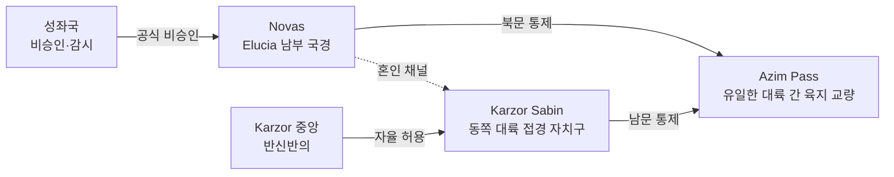

# Novas–Karzor Sabin 왕조 혼인 협약 — 대륙 간 유일 혼인 외교

## 원전 인용 증명

### [필독 1] brainstorm_2026-04-21_worldview_expansion.md:237 (발언 6)
> "북쪽에는 초고대문명의 유산과 응축된 마석이 매우 많이 매장되어있어 동서대륙간 중앙 작은섬을 차지하려 전쟁중"
— 발언 6 (동서 대륙 = 전쟁 중 → 혼인 외교는 예외적 평화 채널)

### [필독 2] political_divisions.md:29-30
> "Novas / 노바스 / 남부 국경 / Azim Pass 북문 제어"
— political_divisions.md (Novas = Azim Pass 북문 → Karzor 접경 왕국)

### [필독 3] wiki/design/worldbuilding/elucia/relations/alliances/alliance_southern_frontier_2026-04-22.md
> Novas·Sylren 남부 방어선 = Azim Pass 통제 핵심
— alliance_southern_frontier (Novas 지정학적 위상)

### [필독 4] brainstorm_2026-04-21_worldview_expansion.md:261 (발언 7)
> "좌우 대륙은 같은 신을 믿지만 서로 해석을 달리한다. 서로 적대적이긴하나"
— 발언 7 (동서 대륙 = 적대 기조, 혼인은 이례적 예외)

### [필독 5] wiki/design/worldbuilding/elucia/relations/conflicts/conflict_azim_pass_toll_2026-04-22.md
> Azim Pass = Novas 8% + Karzor Sabin 10% 이중 통행세 분쟁
— conflict_azim_pass (혼인 = 통행세 분쟁의 외교적 완충)

### [필독 6] _shared_briefing.md:62-64 (Q-CORE)
> 타종족 노예 무역 루트 = Azim Pass 통과
— Q-CORE: 노예 무역 루트 세부 = 직접 서술 최소화

### [필독 7] .claude/failures/FAILURES.md
> FAIL-002: (추정) 표기 의무
— 전체 적용

---

## 요약

**Novas 왕가 ↔ Karzor Sabin 자치구 총독 가문** 혼인 협약은 Elucia 11 왕국 중 **유일한 대륙 간 왕조 혼인**이다(추정). 동서 두 대륙이 Nomen 섬을 놓고 전쟁 중인 상황에서, 유일한 육지 교량인 Azim Pass 를 공동 관리하는 Novas 와 Karzor Sabin 은 실용적 이해로 인해 비밀(혹은 반공식) 혼인 채널을 유지한다(추정). 성좌국은 이 혼인을 공식 승인하지 않으며, 대외적으로 "교류 협정" 수준으로 격하해 발표한다(추정).

---

## 1. 혼인 협약 구조

| 항목 | 내용 |
|------|------|
| **혼인 당사자** | Novas 방계 왕족 ↔ Karzor Sabin 총독 차녀 (추정) |
| **공식도** | 반공식 — 성좌국 비승인, 양측 내부 문서로만 처리 (추정) |
| **실질 목적** | Azim Pass 통행세 분쟁 완충 + 대륙 간 정보 채널 유지 |
| **유지 빈도** | 정치 위기 시 임시 제안 반복 (추정) |

---

## 2. 혼인의 지정학 의미

---

## 3. 혼인 동맹의 이중성

| 구분 | 표면 | 실질 |
|------|------|------|
| **목적** | "변경 평화 유지" | Azim Pass 통행세 분담·정보 공유 |
| **성좌국 입장** | "교류 협정" | 실제 혼인 감시, 친밀도 제한 요구 |
| **Karzor 중앙 입장** | "Sabin 자치 범위" | 동서 통제권 약화 우려 |
| **타종족** | 무관 | 혼인 협약 = 노예 무역 암묵 허용 조건 포함 의혹 (추정) |

---

## 서사적 활용

- **동서 대륙 혼혈 캐릭터**: Novas-Karzor Sabin 혼인 후손 → 양쪽 대륙 언어·문화 보유 동료
- **Act 1 Azim Pass 장면**: 혼인 협약의 실상과 노예 무역 루트 주인공 목격
- **Act 3 A 붕괴**: 이 혼인 협약 폭로 → 성좌국의 Novas 응징 → 남부 방어선 붕괴

---

## Q-CORE 반영

> 타종족 노예 무역 루트 세부 = 이 파일에서 "의혹" 수준만 기록.
> Veilglass 봉인 관련 내용 = 일절 기록하지 않는다.

---

## 대표님 미확정 사항

- 혼인 협약 공식·비공식 법적 지위
- Karzor 중앙과 Sabin 총독 가문의 이 혼인에 대한 온도 차
- 노예 무역 암묵 허용 조항 존재 여부 (추정 — 미확정)

## 다음 Wave 의존

- `intercontinental/azim_pass_diplomacy_2026-04-22.md`: Azim Pass 외교 상세
- `trade_treaties/treaty_azim_pass_transit_2026-04-22.md`: 통행 조약 연동
- **Wave 4 Kingdom-Detailer (Novas)**: 왕가 계보·남부 국경 정치 상세
