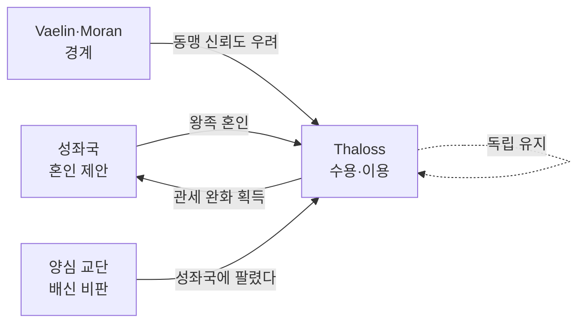

# Solaris–Thaloss 왕조 혼인 동맹 — 교황청 유화 전략

## 원전 인용 증명

### [필독 1] brainstorm_2026-04-21_worldview_expansion.md:350 (발언 9)
> "부패한 교단 (80~90% 다수, Solaris 중심) vs 양심 교단 (10~20% 소수, 국경 왕국 중심)"
— 발언 9 (Thaloss = 양심 교단 강세 왕국 → 성좌국의 유화 대상)

### [필독 2] wiki/design/worldbuilding/elucia/political/power_balance_2026-04-22.md (Wave 2)
> Thaloss = TIER 1 · 성좌국 다음 실질 군사력 1위 (추정)
— power_balance (Thaloss = 성좌국이 반드시 붙잡아야 할 왕국)

### [필독 3] brainstorm_2026-04-21_worldview_expansion.md:370 (발언 10)
> "성좌국은 종교 + 도로 + 화폐 + 곡물창고 4중 헤게모니로 11 왕국을 통제"
— 발언 10 (혼인 = 4중 헤게모니를 보완하는 5번째 통제 수단)

### [필독 4] wiki/design/worldbuilding/elucia/relations/conflicts/historical_enmity_solaris_hegemony_resistance_2026-04-22.md
> Thaloss = 저항 역사 가장 긴 왕국, 북부 2국 독립 선언 전례
— historical_enmity (혼인 = 저항 전력 무마 수단)

### [필독 5] .claude/failures/FAILURES.md
> FAIL-002: (추정) 표기 의무
— 전체 적용

---

## 요약

성좌국은 Thaloss 의 독립 전력과 북부 동맹 주도권을 우려해, **왕족 혼인을 통한 유화 전략**을 수차례 시행해왔다(추정). 교황청 직계 혈통(성좌국 고위 성직자 가문)과 Thaloss 왕가 간 혼인은 표면상 "신앙의 결합"이지만 실질은 **Thaloss 독립 의지 희석 + 성좌국 첩보 채널 확보**의 이중 목적이다(추정). Thaloss 는 이 혼인을 수용하면서도 내부적으로 자국 이익을 관철하는 이중 외교를 구사한다.

---

## 1. 혼인 동맹 구조

| 항목 | 내용 |
|------|------|
| **핵심 혼인** | 성좌국 고위 성직자 가문 여성 → Thaloss 왕자비 (추정) |
| **빈도** | 약 3세대 1회, 정치 위기 시 임시 혼인 제안 (추정) |
| **선물·지참금** | 성좌국 → 성직 서품 특권 부여 + 철 수입 관세 완화 |
| **Thaloss 반대급부** | 양심 교단 단속 강화 약속 (실효 미검증, 추정) |

---

## 2. 성좌국의 목적 vs Thaloss 의 목적

| 구분 | 성좌국 의도 | Thaloss 의도 |
|------|-----------|------------|
| **표면** | "신앙의 결합, 하나된 서쪽 대륙" | "성좌국과의 평화, 왕국 안정" |
| **실질** | Thaloss 왕가 내 친 성좌국 인맥 형성 | 철 관세 완화 + 단기 안전 보장 |
| **장기** | 북부 동맹 내 Thaloss 이탈 유도 | 독립성 유지하면서 혜택 수령 |

---

## 3. 혼인 동맹의 긴장 구조 (추정)

---

## 서사적 활용

- Thaloss 왕실 내 성좌국 혈통 왕비 = 스파이 의혹 or 실제 이중 역할 NPC
- "혼인으로 길들여지는 강자" = 성좌국 헤게모니의 정교함 실증
- Act 2: 왕비 혈통 문제가 Thaloss 내 권력 분열 촉발 가능

---

## Q-CORE 반영

> 성좌국의 종교적 권위 = "교단 정치" 로만 서술.
> 신의 실체·봉인 관련 내용은 이 파일에 일절 기록하지 않는다.

---

## 대표님 미확정 사항

- 현재 왕대 Solaris-Thaloss 혼인 당사자 (추정)
- 성직 서품 특권 구체 내용
- 양심 교단의 이 혼인에 대한 공식 성명 여부

## 다음 Wave 의존

- `sphere_of_influence_solaris_2026-04-22.md`: 4중 + 혼인 5중 헤게모니 연동
- **Wave 4 Kingdom-Detailer (Thaloss)**: 왕가 계보·왕비 역할 상세
