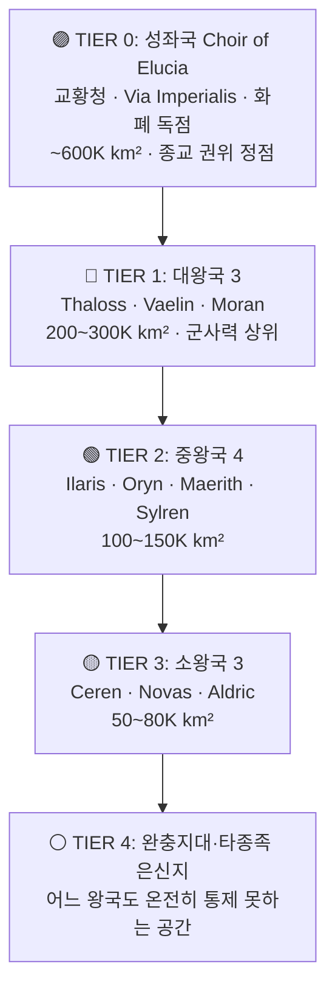

# Elucia 권력 서열

## 원전 인용 증명

### [필독 1] political_divisions.md:43-48
> "엘루시아 성좌국 (수도 소라리스) / Choir of Elucia (Capital: Solaris) / 교황청 보유 · 대륙 최대 권력 · 보라 심볼"
— political_divisions.md:46-48 (성좌국 = 대륙 최대 권력 확정)

### [필독 2] political_divisions.md:56-62 (왕국 분류 확정)
> "| 대왕국 | Thaloss · Moran · Vaelin | 200~300K km² · 군사·인구 상위 | | 중왕국 | Ilaris · Oryn · Maerith · Sylren | 100~150K km² | | 소왕국 | Ceren · Novas · Aldric | 50~80K km²"
— political_divisions.md (왕국 분류 3군 확정)

### [필독 3] wiki/design/worldbuilding/elucia/economy/trade_networks_continental_2026-04-22.md:94-103
> "Solaris 는 지리적으로 Aurion 평원 중심에 위치하여 모든 교역 동맥이 수렴한다. 성좌국은 이를 활용해: 통행세 징수 ... 환전 독점 ... 창고 독점 ... 길드 인증"
— trade_networks_continental (성좌국 경제 패권 구조 확인)

### [필독 4] brainstorm_2026-04-21_worldview_expansion.md:261 (발언 7)
> "좌우 대륙은 같은 신을 믿지만 서로 해석을 달리한다."
— 발언 7 (종교적 권위 = 성좌국 권력 기반)

### [필독 5] wiki/design/worldbuilding/elucia/culture/religious_schism_orthodox_vs_corrupt_2026-04-22.md:70-75
> "성좌국 Solaris · 대도시 대성당 / 교계 전체 80~90% (추정)"
— religious_schism (타락한 교회 = 성좌국 중심 확인)

### [필독 6] .claude/failures/FAILURES.md
> FAIL-002: 대표님 원안 과해석 금지. 원문에 없는 서술은 (추정) 표기
— 전체 파일 준수

### [필독 7] _shared_briefing.md:85-89
> "세계관 철학 3조: 불완전성 — 모든 것은 불완전하다 · 신조차"
— 권력 서열도 불완전하며 도전받는다는 전제

---

## 요약

Elucia 대륙 권력 서열은 **성좌국 Choir of Elucia (Solaris)** 가 정점에 위치하며, 종교적 권위·교역 허브 독점·Via Imperialis 통행세 구조로 실질 패권을 행사한다. 그 아래 대왕국 3 (Thaloss·Vaelin·Moran)이 군사력으로, 중왕국 4 (Ilaris·Oryn·Maerith·Sylren)이 자원·지리로, 소왕국 3 (Ceren·Novas·Aldric)이 틈새 자원 레버리지로 생존한다. 이 서열은 고정이 아니라 **자원 통제·군사 동맹·혼인·종교 충성도에 따라 지속적으로 재편되는 불안정한 균형**이다.

---

## 1. 권력 층위 5단계

---

## 2. 성좌국 — 패권 기제 4원

| 기제 | 내용 | 취약점 |
|------|------|--------|
| **종교 권위** | 모든 왕국 공통 신앙 · 교황 = 신의 대리자 | 타락한 교회 노출 시 붕괴 위험 |
| **도로 패권** | Via Imperialis 통행세 징수권 독점 | 왕국들이 우회로 개설 시 약화 |
| **환전 독점** | 성좌국 주조 금화 = 교역 표준 화폐 | 대왕국 자체 주화 남발 시 경쟁 |
| **창고 독점** | 대규모 곡물·물자 비축 · 흉년 정치 | 연속 풍년 시 창고 기능 약화 |

---

## 3. 대왕국 3 — 군사 쐐기 구조

| 왕국 | 권력 기반 | 성좌국과의 관계 | 대왕국 내 서열 (추정) |
|------|---------|--------------|---------------------|
| **Thaloss** (북부 산맥) | 철·구리 광산 독점 | 철 공급 레버리지로 반독립적 태도 | 1위 (자원 최강) |
| **Vaelin** (북부 평원) | 광대 평야·의무 병력 | 성좌국 충실한 봉신 · 곡물 공급 | 2위 (군사 동원력) |
| **Moran** (북서 해안) | 해군력·항구 통제 | Vaelin 과 동맹, 성좌국 준봉신 | 3위 (해상 전략) |

---

## 4. 중왕국 4 — 틈새 전략

| 왕국 | 권력 기반 | 생존 전략 |
|------|---------|---------|
| **Ilaris** (서해안) | 목재·서해안 항구 | 성좌국·Ceren 사이 중재 역할 |
| **Oryn** (동부 숲) | 약초·목재·Orenwald 삼림 | 완충지대 관리로 자치권 확보 |
| **Maerith** (북동 고지) | 험준 지형 방어 | Thaloss·Vaelin 사이 균형자 |
| **Sylren** (남중앙 평원) | 이중 곡물 공급 | 성좌국 봉신 충실 · 남부 안정자 |

---

## 5. 소왕국 3 — 틈새 자원 레버리지

| 왕국 | 레버리지 자원 | 생존 이유 |
|------|------------|---------|
| **Ceren** (서남 습지) | Loravel 소금 독점 | 소금 없으면 전역 군대·어업 불가 |
| **Novas** (남동 국경) | Azim Pass 북문 통제 | 대륙 간 육로 유일 관문 |
| **Aldric** (남서 호수) | Lonwyn 담수 어류·수운 | 내륙 수운 중계 · 호수 소도 광물 |

---

## 6. 권력 서열 도전 요인

### 6-1. 단기 도전 (현재 시점 기준)

- Thaloss 의 철 가격 인상 → 성좌국 군사력 약화 시 전력 역전 가능
- Ceren 소금 봉쇄 → 전역 군대 겨울 보급 차단 가능
- Vaelin·Moran·Thaloss 북부 3국 동맹 강화 → 성좌국 견제력 증대

### 6-2. 구조적 취약 (서사 활용)

- 타락한 교회 정체 노출 → 성좌국 종교 권위 붕괴
- Act 3 B 화합 선택: 타종족 연합 세력 등장 → 11 왕국 권력 구조 전면 재편
- Act 3 A 인간 선택: 현재 서열 강화·공고화 → 비극적 결말

---

## 대표님 미확정 사항

- 성좌국 교황의 현재 이름·통치 기간 (Wave 4 Kingdom-Detailer 담당)
- 대왕국 3 의 공식 서열 — 대표님 확정 전 Thaloss 1위는 (추정)
- 소왕국이 언제부터 자원 레버리지를 획득했는지 역사 경위 (Wave 3 Historian 담당)

## 다음 Wave 의존

- **Wave 4 Kingdom-Detailer × 12**: 각 왕국 시각에서 이 서열을 어떻게 인식하는지 서술
- **Wave 5 Chronicler**: 권력 서열 역사 변천 기록 (인-월드 연대기)
