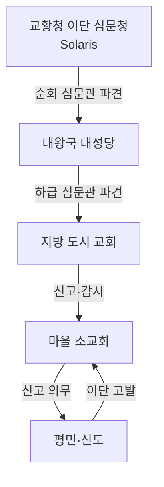

# 타락한 교회 세력 지역 분포

## 원전 인용 증명

### [필독 1] brainstorm_2026-04-21_worldview_expansion.md:433-444 (발언 11)
> "신과 추종집단(타락한 교회)은 언젠가는 칠 준비를한다. (고립되었을때>?)"
— 발언 11 (타락한 교회 = 신의 직속 추종 집단으로 명시)

### [필독 2] brainstorm_2026-04-21_worldview_expansion.md:261 (발언 7)
> "좌우 대륙은 같은 신을 믿지만 서로 해석을 달리한다. 서로 적대적이긴하나 하나의 목표는 지성이있는 타 종족 몰살로 오로지 인류를 위한 행성을 목표로한다."
— 발언 7 (타락한 교회 = 타종족 몰살 이데올로기 집행자)

### [필독 3] brainstorm_2026-04-21_worldview_expansion.md:302-314 (발언 8)
> "타종족은 주변 작은 섬들이나 대륙의 가장자리의 밀림이나 숲, 사막한가운데서 숨어서 생활한다."
— 발언 8 (타락한 교회의 박해가 타종족을 가장자리로 밀어낸 결과)

### [필독 4] wiki/design/worldbuilding/elucia/culture/religious_schism_orthodox_vs_corrupt_2026-04-22.md:56-67
> "타락한 교회 (주류): 규모 / 교계 전체 80~90% / 지리 집중 / 성좌국 Solaris · 대도시 대성당"
— religious_schism (타락한 교회 80~90% 주류 확인)

### [필독 5] brainstorm_2026-04-21_worldview_expansion.md:2776-2795 (발언 46)
> "어느마을이나 교회가있다. 농업위주의 삶 ,서쪽은 징병제"
— 발언 46 (교회 편재성 = 타락한 교회 지배 전역 침투)

### [필독 6] game_setting_complete_2026-04-21.md:248-257
> "교황 = 권능 중독자, 반신적 존재 / 이단 심문관 = 교리 집행자 / 광신도 사제단 = 세뇌된 신도"
> ⚠️ **Q-FIX-4 (세션 #5, 2026-04-22)**: 이 "반신적 존재" 표현은 폐기됨. 현재 공식 표현 = **황제와 동등한 최고 권위자** (두 권위 공동 통치 구조).
— game_setting (타락한 교회 핵심 구성 확정)

### [필독 7] _shared_briefing.md:61-66 (Q-CORE 반영)
> "수정 1·2, 마왕, 첫 번째 신 ... 기록된 역사·전설 층위에서 모호하게 등장"
— Q-CORE (타락한 교회가 숭배하는 신의 정체 직접 서술 금지)

---

## 요약

타락한 교회는 Elucia 전체 교계의 80~90% (추정) 를 차지하며, **성좌국 Solaris 대성당을 정점으로 대도시 대성당·왕국 수도 교회**를 통해 지배력을 행사한다. 발언 46 "어느 마을이나 교회가 있다" 는 곧 타락한 교회가 농촌 마을까지 침투해 있음을 의미한다. 단, 마을 교회는 중앙 지시의 직접 집행자이기보다는 징세·등록·감시의 말단 기구이며, 실제 타락의 농도는 도시로 갈수록 짙어진다.

---

## 1. 지역별 타락 교회 장악도 (추정)

| 지역 | 장악도 | 이유 |
|------|--------|------|
| **성좌국 Solaris 대성당 · 교황청** | 100% (정점) | 교황 직할 · 권능 중독 구조 |
| **대왕국 수도 대성당 (Vaelin·Moran·Thaloss)** | 80~95% | 대주교 = 귀족 권력 유착 · 왕실 지원 |
| **중왕국 수도 교회 (Ilaris·Oryn·Maerith·Sylren)** | 70~85% | 주교 중앙 파견 · 지방 귀족 유착 |
| **소왕국 수도 (Ceren·Novas·Aldric)** | 60~75% | 소왕국 독립성 · 일부 완화 |
| **지방 도시 교회** | 50~70% | 주교 재량 편차 |
| **마을 소교회** | 30~50% | 개인 신관 재량 · 단순 집행 |

---

## 2. 타락 교회 핵심 거점 지도

### 2-1. 1등급 거점 — 교황청 직할

**성좌국 Solaris — 대성당 및 교황청**
- 교황 직속 이단 심문청 본부 위치 (추정)
- 대륙 전체 교회 인사권 집중
- 대주교·주교 임명권 = 간접 왕국 통제 수단
- Q-CORE 반영: "첫 번째 신의 뜻" 이라는 공식 명분으로 타종족 박해 정당화

### 2-2. 2등급 거점 — 대왕국 대성당

| 왕국 | 수도 대성당 역할 |
|------|----------------|
| **Vaelin** | 北부 평원 교구 총괄 · 의무 병역 신병 축복 의식 |
| **Moran** | 北西 해안 교구 · 항구 선박 출항 의식 독점 |
| **Thaloss** | 산악 교구 · 광부 안전 기도 + 이단 탄압 강경파 (추정) |

### 2-3. 3등급 거점 — 도시 교회망

- Via Imperialis 연변 상업 도시마다 교회 검문 기능 수행
- 통행세 영수증 + 성인식 목걸이 확인 = 교회가 교통 통제 부분 담당
- 타종족 의심자 색출·신고 체계 운영

---

## 3. 타락 교회의 이단 심문 체계 (공간 기반)

---

## 4. 동서 종교 갈등 — Karzor 교회와의 관계

발언 7: *"좌우 대륙은 같은 신을 믿지만 서로 해석을 달리한다."*

| 항목 | Elucia 타락 교회 | Karzor 교회 (추정) |
|------|----------------|-----------------|
| 공통점 | 같은 신 숭배 · 타종족 몰살 공동 목표 | 동일 |
| 차이점 | 교황 중심 위계 교회 | 성좌(Hierarch) 중심 신정(神政) 체계 |
| 관계 | 상대방을 이단으로 선언하지 않되 "정통 해석 왜곡" 으로 적대 | 동일 |
| 외교 | 타종족 박해는 협력 · 교리 해석은 냉전 | 동일 |

> (추정 · 대표님 미확정): Karzor 교회와의 공식 관계는 "적대적 형제" 구조. 같은 목적, 다른 방법.

---

## 5. 서사 활용

- **Ch.02 마을의 저녁**: 주인공이 마을 소교회를 지나며 위화감 느끼는 연출 가능
- **Ch.06 기사 동료**: 타락 교회 대성당 출신 기사도대학 교육 = 세뇌 구조 인식
- **Ch.09 양심파 신관**: 타락 교회 주류 속 각성 — 마을 소교회에서 홀로 의심 시작
- **Act 2 Ch.19 수배자**: 타락 교회 이단 심문청이 Elucia·Karzor 양대 교회에 주인공 수배 발령

---

## 대표님 미확정 사항

- 타락한 교회와 Karzor 교회의 공식 냉전 선언 여부
- 이단 처벌 방식 구체 (화형·추방·노예화 중 택)
- 교황 현재 이름·재위 기간 (Wave 4 Kingdom-Detailer 담당)
- 용족 공격 준비의 구체 계획 (발언 11 "고립될 때" 기준)

## 다음 Wave 의존

- **Wave 4 Kingdom-Detailer (Solaris·Vaelin·Moran)**: 이단 심문청 건물·인원 상세
- **Wave 5 Chronicler**: 이단 재판 기록·교리 선언문 인-월드 문헌
