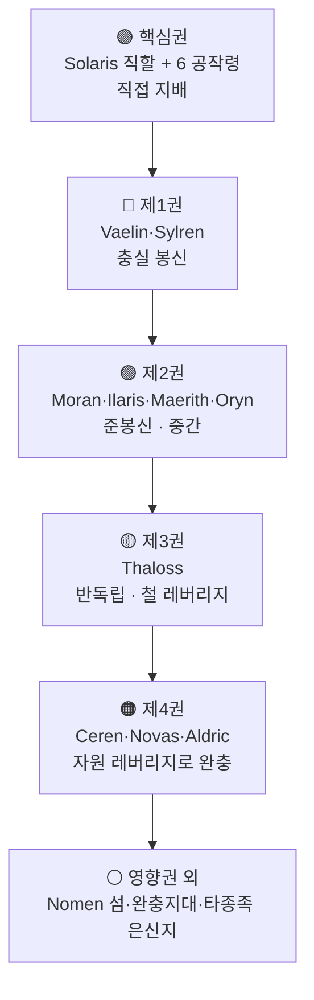

# 성좌국 Choir of Elucia 영향권 구조

## 원전 인용 증명

### [필독 1] political_divisions.md:46-48
> "엘루시아 성좌국 (수도 소라리스) / Choir of Elucia / 교황청 보유 · 대륙 최대 권력 · 보라 심볼"
— political_divisions.md:46-48 (성좌국 정점 지위 확정)

### [필독 2] wiki/design/worldbuilding/elucia/economy/trade_networks_continental_2026-04-22.md:94-103
> "성좌국은 이를 활용해: 통행세 징수 ... 환전 독점 ... 창고 독점 ... 길드 인증"
— trade_networks_continental (경제 패권 4원 확인)

### [필독 3] brainstorm_2026-04-21_worldview_expansion.md:2776-2795 (발언 46)
> "어느마을이나 교회가있다. 농업위주의 삶 ,서쪽은 징병제"
— 발언 46 (교회 편재 = 성좌국 종교 감시망 전역 투사)

### [필독 4] brainstorm_2026-04-21_worldview_expansion.md:261 (발언 7)
> "좌우 대륙은 같은 신을 믿지만 서로 해석을 달리한다."
— 발언 7 (종교 권위 = 성좌국의 단 하나의 해석 독점 주장)

### [필독 5] wiki/design/worldbuilding/elucia/political/borders_disputed_2026-04-22.md:97-99
> "성좌국 교황청은 왕국 간 분쟁에서 중재자 역할을 한다. 그러나 교황청 자신도 이해관계자"
— borders_disputed (중재 권위 = 레버리지이자 새 분쟁 원인)

### [필독 6] _shared_briefing.md:85-89 (세계관 철학)
> "불완전성 — 모든 것은 불완전하다 · 신조차"
— 성좌국 패권도 불완전하며 Act 3 에서 도전받음

### [필독 7] .claude/failures/FAILURES.md
> FAIL-002: 대표님 원안 과해석 금지. (추정) 표기 의무
— 전체 적용

---

## 요약

성좌국 Choir of Elucia 는 **종교·경제·법적 3중 구조** 로 10 왕국 전체를 간접 지배한다. 단순한 봉건 군주가 아니라 "신의 뜻을 독점 해석하는 최고 권위" 로서 각 왕국이 성좌국의 인정 없이는 왕위 계승·교역·외교를 정상 운영할 수 없도록 설계된 구조다. 그러나 이 영향권은 자원 보유 왕국(Thaloss·Ceren·Novas)의 레버리지에 의해 지속적으로 잠식되는 **불안정한 패권**이다.

---

## 1. 영향권 3중 구조

### 1-1. 종교 영향권 — 교리 독점

| 기제 | 내용 |
|------|------|
| **왕위 축성** | 신임 국왕은 반드시 교황의 축성을 받아야 정통성 인정 |
| **대주교 임명권** | 각 왕국 최고위 성직자를 교황이 임명 → 왕국 내부 감시자 파견 |
| **이단 선언권** | 어느 왕국이든 이단으로 선언 → 왕위 파문 + 다른 왕국의 성전(聖戰) 선포 가능 |
| **교리 해석 독점** | "같은 신" 의 올바른 해석을 교황만이 선포할 권리 보유 |

### 1-2. 경제 영향권 — 교역 통제

| 기제 | 내용 |
|------|------|
| **Via Imperialis 통행세** | 성좌국 대로 통과 물자에 세관세 부과 |
| **환전 독점** | 성좌국 주조 금화 = 대륙 표준 화폐 강제 |
| **창고 비축·배분** | 흉년 시 성좌국 곡물 배분으로 정치 종속 유발 |
| **길드 허가증** | 교역상 길드 등록을 성좌국 통해서만 인정 |

### 1-3. 법적 영향권 — 분쟁 중재권

| 기제 | 내용 |
|------|------|
| **왕국 간 전쟁 인가** | 공식 선전(宣戰)은 교황청 통보 의무 |
| **영토 분쟁 중재** | Greygate·Eloryn 등 분쟁을 교황청이 최종 중재 |
| **조약 승인** | 왕국 간 주요 조약은 성좌국 인장 없으면 국제 효력 없음 (추정) |

---

## 2. 영향권 지도 (동심원 구조)

---

## 3. 왕국별 성좌국 영향권 수용도

| 왕국 | 수용도 | 저항 기반 | 현재 긴장 수위 |
|------|--------|---------|-------------|
| **Vaelin** | 90% | 없음 · 곡물 의존 | 평온 |
| **Sylren** | 85% | 없음 · 남부 안정자 역할 | 평온 |
| **Moran** | 75% | 해군력 · 北西 독자성 | 중간 |
| **Maerith** | 70% | 지형 방어 · 고지 독자성 | 중간 |
| **Ilaris** | 70% | 항구 수익 · 서해안 독자성 | 중간 |
| **Oryn** | 65% | 삼림 은신 · 타종족 완충 | 중간-높음 |
| **Aldric** | 60% | 호수 수운 · 변경 위치 | 중간-높음 |
| **Ceren** | 55% | 소금 독점 레버리지 | 높음 |
| **Novas** | 50% | Azim Pass 북문 통제 | 높음 |
| **Thaloss** | 45% | 철 광산 독점 레버리지 | 최고 |

---

## 4. 성좌국 영향권의 약화 시나리오 (서사 활용)

| 시나리오 | 트리거 | 결과 |
|---------|--------|------|
| 타락한 교회 정체 노출 | 주인공 Act 2~3 폭로 | 종교 권위 붕괴 → 왕국 이탈 시작 |
| Thaloss 철 수출 금지 | 대왕국 반란 선언 | 성좌국 군사 동원 불능 |
| Ceren 소금 봉쇄 | 경제 분쟁 극단화 | 전역 보급 차단 → 성좌국 패닉 |
| 북부 3국 동맹 성좌국 대항 | 군사 쿠데타 시나리오 | 교황 폐위 위기 |
| Act 3 B 화합 선택 | 주인공 타종족 연합 | 기존 권력 서열 전면 붕괴 |

---

## 대표님 미확정 사항

- 교황 파문 사례가 역사상 실제로 있었는지 (Wave 3 Historian 담당)
- 성좌국이 왕국 간 전쟁을 공식 허가한 마지막 사례 (역사 레퍼런스용)
- 성좌국 직할 공작령 6개 이름·위치 (Wave 4 Kingdom-Detailer 담당)

## 다음 Wave 의존

- **Wave 4 Kingdom-Detailer (Solaris)**: 성좌국 내부 통치 구조 상세
- **Wave 4 Kingdom-Detailer (Thaloss·Ceren·Novas)**: 각 왕국의 저항 서사 상세
- **Wave 5 World-Integrator**: 영향권 붕괴 시 전체 지정학 재편 시뮬레이션
