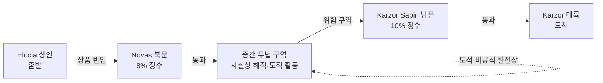

# Azim Pass 통행 협정 — 대륙 간 유일 육지 교량 통행 체계

## 원전 인용 증명

### [필독 1] brainstorm_2026-04-21_worldview_expansion.md:176 (발언 5)
> "Azim Pass 는 동서 대륙의 유일한 육로 연결점 ... Novas(Elucia) 가 북문, Karzor Sabin 자치구가 남문 통제"
— 발언 5 (Azim Pass 구조 직접 확정)

### [필독 2] wiki/design/worldbuilding/elucia/relations/conflicts/conflict_azim_pass_toll_2026-04-22.md
> Novas 8% + Karzor Sabin 10% = 실제 부담 11~18% 이중 통행세 분쟁
— conflict_azim_pass (이 협정의 갈등 배경)

### [필독 3] wiki/design/worldbuilding/elucia/relations/alliances/alliance_southern_frontier_2026-04-22.md
> Novas = 남부 방어선 Azim Pass 북문 통제 전략 왕국
— alliance_southern_frontier (Novas 지정학 위상)

### [필독 4] brainstorm_2026-04-21_worldview_expansion.md:261 (발언 7)
> "좌우 대륙은 같은 신을 믿지만 서로 해석을 달리한다. 서로 적대적이긴하나"
— 발언 7 (동서 적대 = 통행 협정 필요성의 배경)

### [필독 5] brainstorm_2026-04-21_worldview_expansion.md:2801 (발언 49)
> "동쪽 대륙은 타종족이 75% ..."
— 발언 49 (Azim Pass = 타종족 이동 주요 루트)

### [필독 6] .claude/failures/FAILURES.md
> FAIL-002: (추정) 표기 의무
— 전체 적용

---

## 요약

**Azim Pass 통행 협정**은 Elucia 성좌국·Novas·Karzor 왕조 삼자가 체결한 **대륙 간 유일 육로 통행 체계 조약**이다(추정). 성좌국이 Novas 의 북문 통행세 징수권을 공식 인정하는 대신, Karzor 도 남문 통행세 징수권을 가진다는 이중 통행세 구조가 이 조약의 핵심이다. 실질적으로는 두 게이트를 모두 통과해야 하는 상인들이 이중 부담을 지는 비효율 구조가 방치되어 있다.

---

## 1. 협정 핵심 조항 (추정 · 현행)

| 조항 | 내용 |
|------|------|
| **북문 징수권** | Novas = Elucia 대륙 방면 통행세 8% 징수 (추정) |
| **남문 징수권** | Karzor Sabin = Karzor 대륙 방면 통행세 10% 징수 (추정) |
| **중간 구역** | Pass 중심 500m = 어느 쪽도 관할 불인정 → 사실상 무법 지대 |
| **군사 통행** | 양측 소규모 경비대만 허용 · 대규모 군대 통행 시 상대방 사전 통보 필수 |
| **성좌국 권한** | 협정 위반 시 성좌국이 중재 개입 가능 (Karzor 비동의 조항) |
| **타종족 통행** | 공식 조항 없음 → 사실상 묵인 (추정) |

---

## 2. 협정의 현실 작동

---

## 3. 협정의 구조적 문제

| 문제 | 내용 |
|------|------|
| **이중 통행세** | 양측 합산 18% 이상 → 교역 비용 급등 |
| **중간 무법 구역** | 협정 공백 → 도적·비공식 환전상 자생 |
| **타종족 조항 부재** | 동쪽 대륙 타종족 75% → 이동 시 법적 근거 없음 |
| **노예 무역** | Pass 통과 노예 상단 = 타종족 추정 (협정 묵인, 추정) |
| **성좌국 중재권** | Karzor 비동의 → 사실상 유명무실 |

---

## 서사적 활용

- 중간 무법 구역 = Act 1 주인공 첫 도전 공간: 도적 조우, 숨겨진 타종족 난민
- 이중 통행세의 부조리 = 세계관 불완전성 실증
- 협정 재건 = Act 3 B 화합: Azim Pass 중립화·통합 관리 기구 설립

---

## 대표님 미확정 사항

- 통행세 정확 수치 (현재 8%·10% 추정)
- 중간 구역 거버넌스 공식 상태
- 노예 상단 통행 조항 존재 여부 (추정)

## 다음 Wave 의존

- `intercontinental/azim_pass_diplomacy_2026-04-22.md`: 대륙 간 외교 상세
- `marriage_novas_karzor_sabin_2026-04-22.md`: 혼인 협약 연동
- **Wave 4 Kingdom-Detailer (Novas)**: 북문 통제 경제·군사 상세

<!-- auto-generated-related:start -->
## 🔗 관련 (auto-generated)

> `scripts/obsidian/build_backlinks.py` 로 자동 생성. 수정 금지 — 다음 실행 시 덮어쓰여집니다.

### ⬆️ 상위

- [[../../../../../MOC]] — wiki 루트
- [[../../MOC]] — Elucia 허브

<!-- auto-generated-related:end -->
