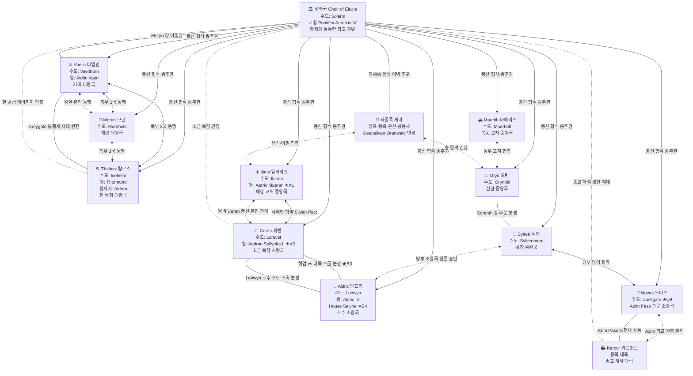
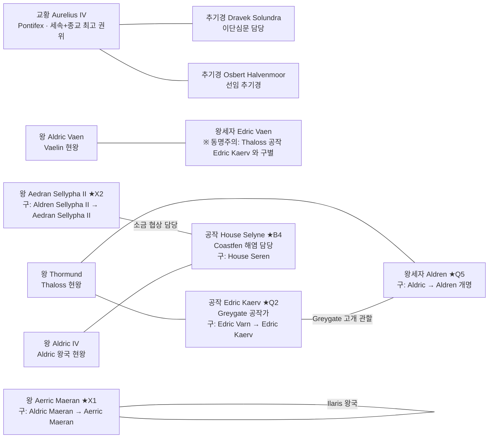

# Elucia 세력 관계도

> **Q-FIX 반영 인명 기준**:
> - Ilaris 왕: Aerric Maeran (X1 개명 · 구 Aldric Maeran)
> - Ceren 왕: Aedran Sellypha II (X2 개명 · 구 Aldren Sellypha II)
> - Thaloss 왕세자: Aldren (Q-FIX-5 · 구 Aldric)
> - Thaloss 공작: Edric Kaerv (Q-FIX-2 · 구 Edric Varn)
> - Aldric 왕국 House: Selyne (Q-FIX-4 · 구 House Seren)
> - Novas 수도: Duskgate (Q-FIX-9 · 구 Duskmoor)
> - 교황 위상: 황제와 동등한 최고 권위자 (Q-FIX-3 · 반신적 표현 삭제)

---

## 관계 범례

```
실선 녹색  ─── 동맹 / 협력
실선 적색  ─── 갈등 / 긴장 / 적대
실선 회색  ─── 중립 / 형식적 봉신
점선 회색  ─── 비밀 관계 / 은밀 접촉
굵은 화살표 →  권위 관계 (상위 → 하위)
```

---

## 전체 관계 다이어그램 (mermaid)



---

## 주요 인물 노드 (Q-FIX 반영)



---

## 핵심 관계 요약 표

| 관계 | 당사자 | 성격 | Q-FIX 관련 |
|------|--------|------|----------|
| **북부 3국 동맹** | Vaelin·Moran·Thaloss | 군사·경제 협력 | — |
| **서해안 협약** | Ilaris·Ceren | 해상+소금 공조 | — |
| **소금·해염 분쟁** | Ceren ↔ Aldric (Coastfen) | 실제 왕국 간 분쟁 | B-3 서사화 · House Selyne(B-4) |
| **Greygate 세대 원한** | Thaloss ↔ Vaelin | 15년 전쟁 잔재 | 왕세자 Aldren(Q5)·공작 Kaerv(Q2) |
| **철 공급 긴장** | Thaloss ↔ 성좌국 | 레버리지 경쟁 | — |
| **Azim Pass 갈등** | Novas ↔ Karzor | 통행세 + 대륙 간 냉전 | Duskgate(Q9) |
| **종교 냉전** | 성좌국 ↔ Karzor | 신 해석 대립 | — |
| **Ilaris 왕실 개명** | — | 동명 해소 | Aerric Maeran(X1) |
| **Ceren 왕실 개명** | — | 동명 해소 | Aedran Sellypha II(X2) |
| **교황 위상 재정의** | 성좌국 | 반신 → 황제와 동급 | Q-FIX-3 |
| **타종족 은신** | 엘프·용족 vs 성좌국 | 잠재 갈등 | B-2 연동 (몰살 이념) |

---

*관계도 생성: 2026-04-22 · Wave5-WorldIntegrator*
*Q-FIX 1~9 + X1·X2 전반 반영 완료*
*다음 갱신 기준: 서부 대륙 세력 추가 확정 시*
