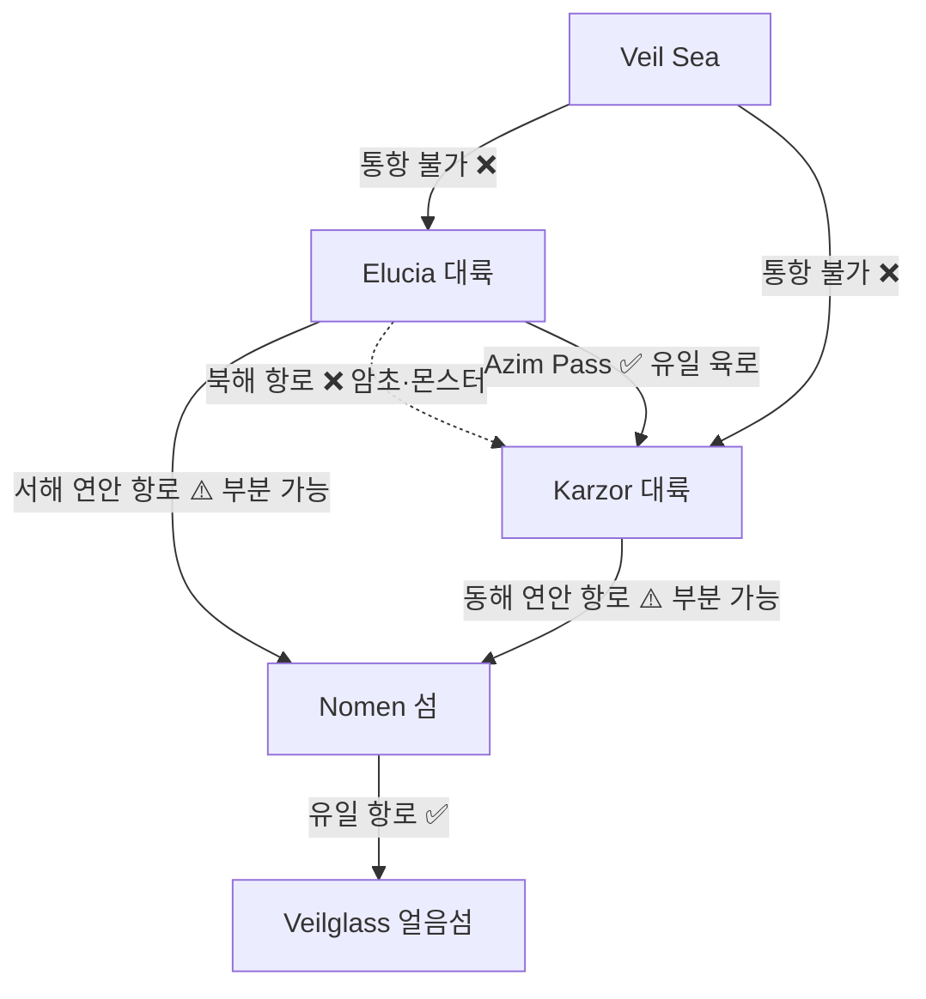

# Azim Pass 대로 — 남부 대륙 간 통행로

## 원전 인용 증명

### [필독 1] brainstorm_2026-04-21_worldview_expansion.md:176 (발언 5) ★ 최우선 원전
> "하단 주황식은 이어진길이다."
— 발언 5, brainstorm_2026-04-21_worldview_expansion.md:176
> "대륙윗쪽에서는 좌우 모두 물길이 너무험하고 작은 암초가 많아서 불가능, 몬스터도 많음."
— 발언 5, brainstorm_2026-04-21_worldview_expansion.md:176 (북쪽 해로 완전 불가 확인)

### [필독 2] political_divisions.md:21
> "아짐 관문 / Azim Pass / 두 대륙 연결 육로"
— political_divisions.md:21 (행성·해역·지형 표)

### [필독 3] political_divisions.md:87
> "사빈 / Sabin / 서부 국경 (아짐 관문 인접)"
— political_divisions.md:87 (Karzor 14 직할자치구 중 Sabin = Azim Pass 바로 동쪽)

### [필독 4] geography/coastlines_2026-04-22.md:137
> "Azim Pass 는 두 대륙이 육로로 연결되는 남부 지협이다. 이 지협 양쪽에 좁은 해협(Azim Narrows)이 있으며, 해협 폭은 최소 약 30–80 km (추정)."
— coastlines_2026-04-22.md:137

### [필독 5] geography/elevation_profile_2026-04-22.md:55
> "형태 / 타원형 (북남 장축) / 북부 Veilglass 방향, 남부 Azim Pass 방향"
— elevation_profile_2026-04-22.md:55

### [필독 6] geography/rivers_major_2026-04-22.md:98
> "Duskway River ... Azim Pass 방향의 마지막 수계 역할."
— rivers_major_2026-04-22.md:98

### [필독 7] FAILURES.md:57 (FAIL-002)
> "대표님 원안에 없는 서술은 (추정) 표기 의무"
— FAILURES.md:57

---

## 요약

**발언 5 "하단 주황식은 이어진길이다"** 에 따라, Azim Pass 는 Elucia 남단과 Karzor 서부를 연결하는 **유일한 대륙 간 육로 통행로** 이다. 북쪽 해로는 Veil Sea 암초·몬스터로 완전 불가능하므로, 이 길은 동서 대륙 교류의 단 하나의 지상 통로다. 폭 약 30~80 km 의 좁은 지협을 가로지르며, 양쪽에 Azim Narrows 해협이 있다. 통행량이 막대하며 양 대륙의 핵심 국제 무역·외교·군사 동맥이다.

---

## 1. 지협 지리 개요

| 항목 | 수치·내용 | 근거 |
|------|---------|------|
| 지협 총 길이 | ~180 km (추정) | Elucia 남단 ~ Karzor 서변 |
| 최협부 폭 | ~30 km (추정) | 양쪽 Azim Narrows 해협 |
| 평균 고도 | ~80~150m (추정) | 완만한 구릉·평지 지형 |
| 양쪽 해협 | **Azim Narrows** × 2 | 조류 강함·사구 여울 |
| 최대 위험 | 계절풍·해협 폭풍 | 봄·가을 통행 위험 |

**핵심 제약 (발언 5 원문 준수)**:
- 북쪽 해로: **완전 불가능** — Veil Sea 암초·몬스터
- 중간 섬 Nomen: 북쪽 얼음섬 항로만, 동서 대륙 연결 기능 없음
- ∴ Azim Pass 육로 = **동서 대륙 연결 유일 경로**

---

## 2. 도로 경로 상세

### 2-1. Elucia 측 접근로 (북단)

**기점**: Novas 왕국 남부 경계 도시 (가칭 **Duskgate**) (추정·대표님 미확정)

| 구간 | 거리 | 자재 | 통행 특성 |
|------|------|------|---------|
| Duskgate → 지협 진입부 | ~80 km | 자갈+흙다짐 | Duskmoor 구릉 하강 |
| 지협 진입부 → 최협부 | ~60 km | 석판 일부·흙 | 양쪽 해협 바람 강함 |
| 최협부 → Karzor 측 접경 | ~40 km | 흙다짐 | 모래 지형 시작 |

### 2-2. Karzor 측 접근로 (남단)

**기점**: Karzor 직할자치구 **Sabin** (서부 국경, Azim Pass 인접 — 정치_divisions.md:87 확정)

| 구간 | 거리 | 자재 | 특성 |
|------|------|------|------|
| Karzor 접경 → Sabin 수도 | ~120 km | 흙·석판 혼합 | 사막 초입부 |
| Sabin 수도 → Zarahim 수도 | ~600 km (추정) | 사막 도로 | Karzor 내부 |

---

## 3. 전략적 중요성

### 3-1. 왜 이 길만 가능한가

### 3-2. 통행 주체 및 규모 (추정)

| 통행 유형 | 일일 통행량 (추정) | 방향 |
|---------|---------------|------|
| 상인·대상(카라반) | 200~400명 | 양방향 |
| 군사 호송대 | 50~100명 | 수시 |
| 순례자 | 100~200명 | 계절성 |
| 외교 사절 | 비정기 | 양방향 |
| 밀수·도망자 | 불명 | 야간 |

---

## 4. 통제 구조

### 4-1. Elucia 측 관문 (북문)

- **관할**: Novas 왕국 + 성좌국 감독관 공동
- **기능**: 관세 징수, 신분 확인, 마족·타종족 의심자 검문
- **구조물**: 성벽형 관문 + 역참 + 군사 주둔지 (추정)
- **통행세**: 성인 1인 은화 2닢 / 마차 1대 금화 1닢 / 대상 규모 협상 (추정)

### 4-2. Karzor 측 관문 (남문)

- **관할**: Sabin 자치구 + Karzor 왕조 직속 세관
- **특성**: Karzor 측은 엄격한 신분제 기반 검문 (추정)

### 4-3. 지협 내 무법 지대

- 최협부 약 **30 km 구간** 은 양 대륙 어느 쪽 관할도 명확하지 않은 사실상 무법 지대 (추정)
- 산적·밀수업자·탈주 노예가 이 구간에 은신 (발언 50 "타종족 은신" 반영)
- 양 대륙 기병대가 순찰하나 완전한 통제는 불가

---

## 5. 계절별 통행 조건

| 계절 | 통행 난이도 | 주요 위험 |
|------|---------|---------|
| 봄 | 위험 | 해협 폭풍·봄비·도로 침수 |
| 여름 | 양호 | 더위·먼지·수원 부족 |
| 가을 | 위험 | 해협 폭풍 재발·시야 저하 |
| 겨울 | 가능 (온화) | 지협 자체는 온화, 접근로 구릉 결빙 주의 |

---

## 6. 역사적 분쟁 기록 (전설 층위)

*인-월드 전설만 기록. Q-CORE 구조 직접 서술 금지.*

- 지협 최협부 구릉에는 **"두 대륙의 신이 악수한 자리"** 라는 돌비석이 있다고 전해진다. 양쪽 교회가 각자 자국 신의 승리를 새겼으며, 비석 자체는 부서져 읽을 수 없다. (대표님 미확정 — 모호 보존)
- Karzor 쪽 구전에는 *"이 길을 막으면 두 대륙 모두 망한다"* 는 상인 격언이 있다. Elucia 측에는 동일 격언이 *"이 길을 가진 자가 세계를 가진다"* 로 전해진다. (대표님 미확정)

---

## 대표님 미확정 사항

- Elucia 측 관문 도시 이름 (본 문서 "Duskgate" 는 작업 가설·추정)
- 지협 내 무법 지대의 실질 통제 주체 (현재 양쪽 공백으로 설정)
- Azim Narrows 해협의 정확한 폭·조류 강도·소형 선박 통행 가능 여부
- 통행세 금액 상세 — (추정) 표기 유지
- 지협 구간에 중립 도시가 있는지 (상인 집결지 가능성)

---

## 다음 Wave 의존 포인트

- **Wave 4 Kingdom-Detailer (Novas)**: Elucia 측 관문 도시·군사 주둔 상세
- **Wave 4 Kingdom-Detailer (Sabin/Karzor)**: Karzor 측 관문 체계 상세
- **Wave 3 Historian**: Azim Pass 가 역사상 봉쇄된 사건 (전쟁 원인·결과)
- **Wave 3 Diplomat**: 현재 Azim Pass 통행 조약 상태 (개방·제한·협상 중)
- **highway_via_imperialis**: VI-S 남간선이 이 파일의 Elucia 측 접근로와 연결됨
