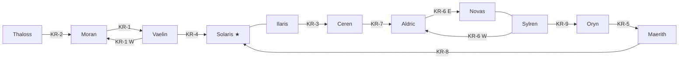

# King's Road — 왕국 간 주요 무역로

## 원전 인용 증명

### [필독 1] brainstorm_2026-04-21_worldview_expansion.md:176 (발언 5)
> "보라색점은 좌측대륙에서 가장큰 제국이고, 나머지는 작은 왕국으로 이루어짐"
— 발언 5, brainstorm_2026-04-21_worldview_expansion.md:186

### [필독 2] political_divisions.md:51–63 (10 왕국 배치)
> "바엘린 Vaelin 북부 평원 / 모란 Moran 북서 / 일라리스 Ilaris 서해안 / 세렌 Ceren 서남 습지 / 탈로스 Thaloss 북부 산맥 / 오린 Oryn 동부 숲 / 마에리스 Maerith 북동 고지 / 실렌 Sylren 남중앙 / 노바스 Novas 남동 국경 / 알드릭 Aldric 남서 호수"
— political_divisions.md:51–63

### [필독 3] geography/rivers_major_2026-04-22.md:51–58
> "Eloryn River ~1,100 km ... Auravel River ~950 km ... Lowen River ~800 km ..."
— rivers_major_2026-04-22.md:51–58 (하천 교차점 = 도로 결절점)

### [필독 4] geography/mountain_ranges_2026-04-22.md:74–76
> "Greygate Pass ~1,600m / Norvend 서쪽 1/3 / Thaloss ↔ Vaelin·Moran 주요 통로"
— mountain_ranges_2026-04-22.md:74

### [필독 5] brainstorm_2026-04-21_worldview_expansion.md:3015 (발언 50)
> "노예시장이 활발한 이유는 지형이 험하고 혹독한 지역이 많아 인적이 없는 지역이 많아서 타종족이 숨어살고있는경우가 많아 타종족비율이 서쪽 25%동쪽75%임"
— 발언 50, brainstorm_2026-04-21_worldview_expansion.md:3015

### [필독 6] FAILURES.md:57
> "대표님 원안에 없는 서술은 (추정) 표기 의무"
— FAILURES.md:57

### [필독 7] _shared_briefing.md:70–73
> "네이밍 세트 B 확정 (계승 의무) ... 신규 지명은 이 계열 어감 계승 (라틴·게르만·켈트 혼합)"
— _shared_briefing.md:70–73

---

## 요약

King's Road 는 Via Imperialis 의 방사 간선 사이를 **횡으로 연결**하는 왕국 간 B급 도로망이다. 총 9개 주요 노선으로 구성되며, 인접 왕국 수도를 직접 연결하거나 주요 교역 도시를 이어준다. 제국 대로보다 등급은 낮으나 실질 교역량의 약 40%가 이 노선을 통과한다. 왕국이 각자 건설·유지하며, 왕국 경계 지점에 관세소가 집중된다.

---

## 1. 주요 King's Road 목록

| # | 노선명 | 연결 왕국 | 연장 (추정) | 자재 | 전략 특성 |
|---|--------|---------|-----------|------|---------|
| KR-1 | **Northern Arc Road** | Vaelin ↔ Moran | ~260 km | 자갈+흙 | 북서 연결 횡단로 |
| KR-2 | **Havren–Thaloss Link** | Moran ↔ Thaloss | ~200 km | 산악 석판 | Morncliff Spine 동쪽 우회 |
| KR-3 | **Silvan–Loravel Coast Road** | Ilaris ↔ Ceren | ~180 km | 자갈 | 서해안 남북 연결 |
| KR-4 | **Aurion Bypass Road** | Vaelin ↔ 성좌국 동북 경계 | ~150 km | 자갈 | Via Imperialis 우회로 |
| KR-5 | **Orenwald Border Road** | Oryn ↔ Maerith | ~220 km | 흙다짐 | 동부 숲 경계 통로 |
| KR-6 | **Southern Cross Road** | Sylren ↔ Aldric ↔ Novas | ~340 km | 자갈 | 남부 3왕국 횡단 |
| KR-7 | **Lonwyn Lake Road** | Aldric ↔ Ceren | ~140 km | 흙+목판 | 호수 연안 도로 |
| KR-8 | **Maerith High Road** | Maerith ↔ 성좌국 동경계 | ~180 km | 고지 석판 | Auryn 고원 횡단 |
| KR-9 | **Sylren–Oryn Forest Edge** | Sylren ↔ Oryn 남부 | ~200 km | 흙다짐 | 동부 숲 남쪽 우회 |

---

## 2. 각 노선 상세

### 2-1. KR-1 Northern Arc Road (북호 도로)

**경로**: Vaelin 수도 → Moran 수도 Havrenport
**연장**: ~260 km
**특성**: Morncliff Spine 의 서쪽 완만한 사면을 따라 북서방향으로 뻗는다. Vaelin 밀·보리를 Moran 의 북서 항구로 수송하는 핵심 곡물 도로.

| 주요 통과 지점 | 거리 누적 | 특성 |
|--------------|---------|------|
| Vaelin 수도 | 0 km | 출발 |
| Mornwell River 상류 도하 | ~80 km | 얕은 여울 (여름·가을 도하 용이) |
| Morncliff 서쪽 기슭 취락 | ~150 km | 역참·식수 보급소 |
| Moran 수도 Havrenport | ~260 km | 종착 |

**관세소**: Moran 진입 전 Morncliff 기슭 (Moran 관할)

---

### 2-2. KR-2 Havren–Thaloss Link

**경로**: Moran 수도 → Thaloss 남부 변경 도시
**연장**: ~200 km
**특성**: Morncliff Spine 동쪽 협곡을 따라 북동으로 올라가는 험로. 겨울 폐쇄 구간 포함. 주요 물자: Thaloss 광석 → Moran 항구 → 해외 수출.

---

### 2-3. KR-3 Silvan–Loravel Coast Road (서해안 연안 도로)

**경로**: Ilaris 수도 Silvanport → Loravel Delta 북단 → Ceren 수도
**연장**: ~180 km
**특성**: 서해안 리아스식 해안을 남쪽으로 따라가는 평탄한 연안 도로. 서해안 어업 물자 수송의 핵심. (상세는 `regional_roads_western_coast_2026-04-22.md` 참조)

---

### 2-4. KR-4 Aurion Bypass Road

**경로**: Vaelin 수도 → 성좌국 동북 경계
**연장**: ~150 km
**목적**: Via Imperialis VI-N 이 혼잡할 때 우회로. 상인들이 관세 회피 목적으로도 이용 (추정).

---

### 2-5. KR-5 Orenwald Border Road

**경로**: Oryn 수도 Orenhold → Maerith 남부 도시
**연장**: ~220 km
**특성**: Orenwald 와 Auryn 고원 경계 지대를 통과. 양 왕국이 공동 유지. 목재·고원 광물 교류 루트.

---

### 2-6. KR-6 Southern Cross Road (남부 횡단로)

**경로**: Sylren 수도 → Aldric 수도 → Novas 서부 도시
**연장**: ~340 km
**특성**: 남부 3왕국을 가로지르는 유일한 동서 횡단로. Soranth 평원·Lonwyn 호수 연안·Duskmoor 구릉을 통과. 농산물·어물·광물 혼합 교역.

| 주요 통과 지점 | 특성 |
|--------------|------|
| Sylren 수도 | Soranth 평원 서쪽 기점 |
| Soranth River 도하 | 교량 또는 여울 (계절 의존) |
| Lonwyn 분기점 | Aldric 방향 분기 |
| Aldric 수도 | 호수 거점 |
| Duskmoor 서부 | Novas 진입 |
| Novas 서부 도시 | 종착 |

---

### 2-7. KR-7 Lonwyn Lake Road

**경로**: Aldric 수도 → Ceren 수도
**연장**: ~140 km
**특성**: Lonwyn Basin 내 호수 남쪽 연안을 따르는 평탄 도로. 습지 구간 일부 목판 敷設. 호수 어업·소금 교역로.

---

### 2-8. KR-8 Maerith High Road (마에리스 고도로)

**경로**: Maerith 수도 → 성좌국 동쪽 경계
**연장**: ~180 km
**특성**: Auryn 고원(고도 800~1,000m)을 횡단. 겨울 완전 통행 불가. 고원 광물·모피 수출 루트.

---

### 2-9. KR-9 Sylren–Oryn Forest Edge

**경로**: Sylren 수도 → Oryn 남부 숲 경계 도시
**연장**: ~200 km
**특성**: Orenwald 남단 숲 가장자리를 서쪽으로 통과. 목재·약초·희귀 숲 산물 교역. 숲 구간은 적색 위험 지역 (타종족 은신 — 발언 8·50 반영).

---

## 3. King's Road 전체 연결도

---

## 4. 관세·통행세 구조

| 왕국 경계 | 관세소 수 | 징수 주체 | 통행세 (추정) |
|---------|---------|---------|------------|
| Vaelin–Moran | 2 | 각국 1개씩 | 소상인 은화 1닢 |
| Ilaris–Ceren | 1 (해안 협소) | Ilaris·Ceren 공동 | 화물 가치 2% |
| Aldric–Ceren | 2 | 각국 | 수산물·소금 현물 가능 |
| Oryn–Sylren | 1 (분쟁 지역 포함) | Sylren 측 강세 (추정) | 목재 부피 기준 |

---

## 대표님 미확정 사항

- 각 King's Road 의 공식 이름 — 본 문서 이름들은 작업 가설·(추정)
- Vaelin 수도·Moran 수도·각 왕국 수도의 구체적 도시 이름 — Wave 4 담당
- 왕국 간 통행세 분쟁 발생 현황 (특히 Oryn–Sylren 경계)
- KR-5 Orenwald Border Road 의 타종족 위협 수준 상세

---

## 다음 Wave 의존 포인트

- **Wave 4 Kingdom-Detailer (각 왕국)**: 왕국 수도 출발점·관세소 위치 구체화
- **Wave 3 Diplomat**: 왕국 간 도로 사용 조약·통행세 분쟁 현황
- **Wave 3 Economist**: King's Road 각 노선의 주력 교역 품목·경제 규모
- `regional_roads_western_coast_2026-04-22.md`: KR-3 상세 분기
