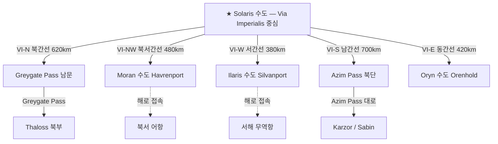

# Via Imperialis — 제국 방사형 대로

## 원전 인용 증명

### [필독 1] brainstorm_2026-04-21_worldview_expansion.md:176 (발언 5) ★ 핵심
> "보라색점은 좌측대륙에서 가장큰 제국이고, 나머지는 작은 왕국으로 이루어짐"
— 발언 5, brainstorm_2026-04-21_worldview_expansion.md:186–188

### [필독 2] political_divisions.md:48
> "엘루시아 성좌국 (수도 소라리스) / Choir of Elucia (Capital: Solaris) / 교황청 보유 · 대륙 최대 권력 · 보라 심볼"
— political_divisions.md:48

### [필독 3] geography/rivers_major_2026-04-22.md:66
> "성좌국 수도 Solaris 는 이 강의 중류 좌안에 위치한다(추정). 강 유역 전체가 Elucia 최대 곡창 지대다."
— rivers_major_2026-04-22.md:66 (Eloryn River 중류 = Solaris 위치 기준)

### [필독 4] political_divisions.md:105–116 (10 권역)
> "Aurion / 오리온 / 중앙 평야 / 성좌국 직할 · Solaris"
— political_divisions.md:113 (Aurion 권역 = 제국 직할)

### [필독 5] game_setting_complete_2026-04-21.md:62–66
> "세계관 철학 3조 ... 모든 존재는 완벽하지 않다."
— game_setting_complete_2026-04-21.md:64

### [필독 6] FAILURES.md:56–58 (FAIL-002)
> "대표님 원안에 없는 서술은 (추정) 표기 의무"
— FAILURES.md:57–58

### [필독 7] _shared_briefing.md:62
> "구조적 진실 ... 직접 서술 금지 / 엘프·용족 구전, 양심파 교회 필사본 등에 파편 단서만 허용"
— _shared_briefing.md:62

---

## 요약

Via Imperialis 는 성좌국 수도 **Solaris** 를 중심으로 뻗는 **5방향 방사형 석판 대로** 다. 제국이 직접 건설·유지하는 유일한 A급 도로로, 10개 왕국 수도와 Solaris 를 연결하는 정치·군사·교역의 대동맥이다. 총연장 약 3,800 km. 로마식 석판 포장 구간은 Solaris 반경 400 km 이내이며, 그 바깥은 자갈 다짐으로 전환된다.

---

## 1. 노선 개요 — 5대 간선

| 간선 | 명칭 | 출발 | 종착 | 연장 | 경유 왕국 |
|------|------|------|------|------|---------|
| **VI-N** | 북간선 (Via Borealis) | Solaris | Greygate Pass 남문 | ~620 km | 성좌국 → Vaelin → Thaloss 남부 |
| **VI-NW** | 북서간선 (Via Havrenis) | Solaris | Moran 수도 | ~480 km | 성좌국 → Vaelin → Moran |
| **VI-W** | 서간선 (Via Silvana) | Solaris | Ilaris 수도 항구 | ~380 km | 성좌국 → Ilaris |
| **VI-S** | 남간선 (Via Solanthis) | Solaris | Novas 남부 경계 | ~700 km | 성좌국 → Sylren → Novas |
| **VI-E** | 동간선 (Via Orynalis) | Solaris | Oryn 수도 | ~420 km | 성좌국 → Maerith 접경 → Oryn |

---

## 2. 각 간선 상세

### 2-1. VI-N 북간선 (Via Borealis) — 군사 대로

**경로**: Solaris → Aurion 평야 북단 → Vaelin 수도 → Thaloss 남변 → Greygate Pass 남문

| 구간 | 거리 | 자재 | 특성 |
|------|------|------|------|
| Solaris → Vaelin 수도 | ~280 km | 석판 포장 | Eloryn River 동안 추적, 평탄 |
| Vaelin 수도 → Thaloss 남변 | ~220 km | 석판+자갈 | 구릉 오르막 시작 |
| Thaloss 남변 → Greygate 남문 | ~120 km | 암반 절개 | 경사 급상승 · 겨울 위험 |

**통행 시간**: Solaris–Greygate (군단 행군 기준 21일, 역마 기준 7일)

**전략 가치**: 북쪽 Thaloss 산맥 방어선 보강용 병력 수송 대동맥. 철광·광석 남하 수송로.

---

### 2-2. VI-NW 북서간선 (Via Havrenis)

**경로**: Solaris → Mornwell River 중류 → Moran 수도 Havrenport

| 구간 | 거리 | 자재 | 특성 |
|------|------|------|------|
| Solaris → Vaelin 분기점 | ~150 km | 석판 | VI-N 공유 구간 |
| 분기점 → Moran 수도 | ~330 km | 자갈·흙 | Morncliff Spine 서쪽 우회 |

**주요 물자**: 북서 어항 해산물, Morncliff 석재 → Solaris 방향. 성좌국 직물·세공품 → 북서 방향.

---

### 2-3. VI-W 서간선 (Via Silvana) — 무역 대로

**경로**: Solaris → Eloryn River 하류 → Ilaris 수도 Silvanport

| 구간 | 거리 | 자재 | 특성 |
|------|------|------|------|
| Solaris → Eloryn 도하점 | ~120 km | 석판 | 최고 밀도 상업 구간 |
| Eloryn 도하 → Ilaris 수도 | ~260 km | 석판 | Silvan 숲 서쪽 연안 추적 |

**핵심 기능**: 서해안 항구 수입품을 Solaris 로 반입하는 **제국 무역 대동맥**. 교역량 기준 5대 간선 중 1위.

---

### 2-4. VI-S 남간선 (Via Solanthis) — Azim Pass 전진로

**경로**: Solaris → Sylren 수도 → Novas 남부 → Azim Pass 북단

| 구간 | 거리 | 자재 | 특성 |
|------|------|------|------|
| Solaris → Sylren 수도 | ~280 km | 석판 | Auravel River 동안 추적 |
| Sylren 수도 → Novas 북단 | ~200 km | 자갈 | 구릉 지대, 속도 저하 |
| Novas 북단 → Azim Pass 북문 | ~220 km | 흙+자갈 | 경계 지대, 보안 초소 밀집 |

**특이사항**: 이 간선의 남쪽 끝이 `highway_azim_pass_2026-04-22.md` 와 연결된다.

---

### 2-5. VI-E 동간선 (Via Orynalis)

**경로**: Solaris → Aurion Divide 동편 → Oryn 수도 Orenhold

| 구간 | 거리 | 자재 | 특성 |
|------|------|------|------|
| Solaris → Maerith 접경 | ~220 km | 석판+자갈 | 구릉 완만, 목재 수송多 |
| Maerith 접경 → Oryn 수도 | ~200 km | 흙다짐 | 숲 관통 구간, 시야 좁음 |

---

## 3. Via Imperialis 노선 구조도



---

## 4. 도로 등급 및 폭 단면

```
[석판 포장 구간 — Solaris 반경 400km 이내]
  ┌──────────────────────────────────┐
  │  보도 │  마차로  │  중앙선  │  마차로  │  보도  │
  │  1m  │   3.5m  │  0.5m   │   3.5m  │  1m   │
  └──────────────────────────────────┘
              총 폭 9.5m

[자갈 다짐 구간 — 외곽]
  ┌──────────────────────┐
  │   마차로   │   마차로   │
  │    3m    │    3m    │
  └──────────────────────┘
           총 폭 6m
```

---

## 5. 역참·보급소 배치 (상세는 toll_stations 파일 참조)

Via Imperialis 주요 간선에는 **30~40 km 간격** 으로 제국 직속 역참(Waystation) 이 배치된다.

| 간선 | 역참 수 (추정) | 소속 |
|------|------------|------|
| VI-N | 16개 | 성좌국 직할 |
| VI-NW | 12개 | 성좌국 직할 |
| VI-W | 10개 | 성좌국 직할 |
| VI-S | 18개 | 성좌국 직할 |
| VI-E | 11개 | 성좌국 직할 |

---

## 6. 전설 층위 (Q-CORE 간접 단서)

*구조적 진실 직접 서술 금지. 인-월드 전설만.*

- Solaris 중심광장에서 뻗어나가는 방사형 대로의 **첫 번째 돌** 은 "교황이 맨손으로 땅에 박았다" 는 교회 전설이 있다. 일부 건축 필사본은 그 돌이 *"다른 돌보다 가볍고 빛을 낸다"* 고 기록한다. (Q-CORE 간접 단서 — 수정 2 복선 불허. 해석 금지)
- Aurion 평야 구간에는 밤이 되면 길가에 **"등불 없이 빛나는 이끼"** 가 있다는 상인 구전이 있다. 교회는 이를 "성스러운 땅의 은총" 으로 공식 해석한다. (대표님 미확정 — 모호 보존)

---

## 대표님 미확정 사항

- 5대 간선의 공식 라틴식 이름 — 본 문서의 이름은 작업 가설·(추정). 대표님 확정 대기
- Solaris 수도 내 Via Imperialis 기점 광장의 이름·구조
- 각 간선의 겨울철 통행 가능 여부 (특히 VI-N 북간선 Thaloss 구간)
- 제국 역참 운영 주체가 성좌국 직속인지 왕국에 위임인지 미확정

---

## 다음 Wave 의존 포인트

- **Wave 3 Historian**: Via Imperialis 건설 시대 (어느 교황 치세?) — 도로가 제국 팽창의 증거
- **Wave 4 Kingdom-Detailer (성좌국)**: Solaris 기점 광장, 각 간선의 Solaris 내 진입로 상세
- **Wave 4 Kingdom-Detailer (Thaloss)**: VI-N 북간선 Thaloss 구간 — 산악 요새 배치
- **Wave 4 Kingdom-Detailer (Novas)**: VI-S 남간선 Novas 구간 — Azim Pass 경계 통제

<!-- auto-generated-related:start -->
## 🔗 관련 (auto-generated)

> `scripts/obsidian/build_backlinks.py` 로 자동 생성. 수정 금지 — 다음 실행 시 덮어쓰여집니다.

### ⬆️ 상위

- [[../../../../MOC]] — wiki 루트
- [[../MOC]] — Elucia 허브

### 📑 카테고리 개요

- [[00_overview]]

### 🔗 형제 노드

- [[bridges_and_fords_2026-04-22]]
- [[highway_azim_pass_2026-04-22]]
- [[highway_kings_road_2026-04-22]]

<!-- auto-generated-related:end -->
