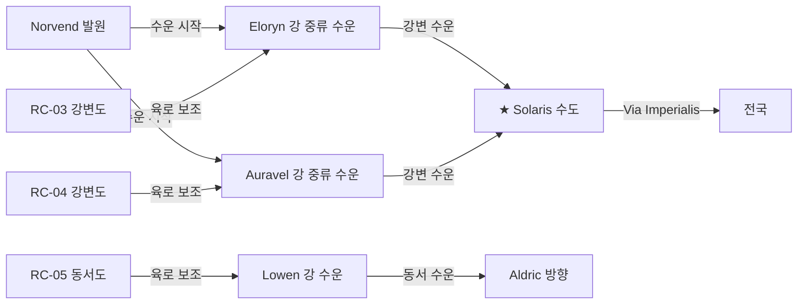

# 중부 지방 중로 — Aurion 평야 권역

## 원전 인용 증명

### [필독 1] political_divisions.md:112–113
> "Aurion / 오리온 / 중앙 평야 / 성좌국 직할 · Solaris"
— political_divisions.md:113

### [필독 2] geography/rivers_major_2026-04-22.md:82–86
> "Auravel River ... 성좌국 동쪽과 Sylren·Ceren 왕국을 적신다."
— rivers_major_2026-04-22.md:82–86

### [필독 3] geography/rivers_major_2026-04-22.md:83–86
> "Lowen River ... Aurion Divide 구릉 서쪽에서 발원해 서쪽으로 흘러 Lonwyn Basin으로 합류 ... 내륙 수운의 동서 축 역할"
— rivers_major_2026-04-22.md:83–86

### [필독 4] brainstorm_2026-04-21_worldview_expansion.md:176 (발언 5)
> "좌측은 강이 많고 풍요로움"
— 발언 5, brainstorm_2026-04-21_worldview_expansion.md:176

### [필독 5] _shared_briefing.md:106–113
> "제국 ~600K km² (신성로마 규모) ... 대왕국 200~300K km² ... 왕국당 지방도시 5~8"
— _shared_briefing.md:106–113

### [필독 6] FAILURES.md:57
> "대표님 원안에 없는 서술은 (추정) 표기 의무"
— FAILURES.md:57

### [필독 7] geography/elevation_profile_2026-04-22.md:87
> "Ⅳ 평야대 / 50–200m / 중앙 Aurion·남부 Soranth / 밀·보리 경작지·대규모 목축 / 성좌국·Sylren"
— elevation_profile_2026-04-22.md:87

---

## 요약

중부 지방 중로는 **Aurion 평야** (성좌국 직할 중앙 평야) 를 그물망처럼 촘촘히 연결하는 C급 지방도 네트워크다. Elucia 최고 도로 밀도 지역으로, 농산물 집하, 주요 강의 강변 수송, 성좌국 내부 행정 연결이 주 기능이다. Via Imperialis 5개 간선 사이를 보조하는 격자형 연결로가 특징.

---

## 1. 중부 지방 중로 목록

| # | 노선명 | 권역 | 연장 (추정) | 핵심 기능 |
|---|--------|------|-----------|---------|
| RC-01 | **Aurion North Grid** | 성좌국 북부 직할 | ~150 km | VI-N·VI-NW 사이 격자 연결 |
| RC-02 | **Aurion East Grid** | 성좌국 동부 직할 | ~130 km | VI-E·VI-N 사이 격자 |
| RC-03 | **Eloryn Riverside Road** | 성좌국·Ilaris 경계 | ~200 km | Eloryn 강 좌안 강변도 |
| RC-04 | **Auravel Riverside Road** | 성좌국·Sylren | ~220 km | Auravel 강 동안 강변도 |
| RC-05 | **Lowen East-West Road** | 성좌국·Aldric | ~180 km | Lowen 강 북안 동서 수송로 |
| RC-06 | **Solaris Ring Road** | 성좌국 수도권 | ~80 km | Solaris 수도 외곽 순환로 |
| RC-07 | **Sylren Inner Roads** | Sylren | ~200 km | Soranth 평원 내부 격자 |
| RC-08 | **Oryn Frontier Road** | Oryn·성좌국 동경계 | ~160 km | 숲 경계 감시로 |
| RC-09 | **Maerith–Oryn Connector** | Maerith 남부·Oryn 북부 | ~140 km | 고원↔숲 연결 |

---

## 2. 핵심 노선 상세

### 2-1. RC-06 Solaris Ring Road (솔라리스 순환로)

**경로**: Solaris 수도를 중심으로 반경 약 15~20 km 원형 순환
**총 연장**: ~80 km (환형)
**기능**: 5개 Via Imperialis 간선이 Solaris 로 진입하기 전 물자를 분산·집결하는 **외곽 환형 도로**. 시장·창고·군사 막사가 이 순환로 위에 집중.
- **폭**: 6~8m (넓은 석판 포장)
- **통행세**: 없음 (Solaris 도시세 별도)

### 2-2. RC-03 Eloryn Riverside Road (엘로린 강변도)

**경로**: Solaris 서쪽 → Eloryn River 중류 좌안 → Ilaris 경계 하구 근방
**총 연장**: ~200 km
**기능**: Eloryn 강 중·하류의 **강변 수운** 보조 육로. 강변 선착장 연결, 창고 거점 연결. 수운이 불가한 상류 급류 구간의 대체 육로 역할도 겸함.

### 2-3. RC-04 Auravel Riverside Road (오라벨 강변도)

**경로**: Auravel River 발원부 남쪽 → Aurion 평야 남단 → Sylren 경계
**총 연장**: ~220 km
**기능**: Auravel 강 관개 농경지를 따라 농산물 집하. 성좌국 남쪽 경계와 Sylren 북쪽을 연결하는 주요 C급 생산자 도로.

### 2-4. RC-07 Sylren Inner Roads (실렌 내부 격자)

**경로**: Sylren 수도를 중심으로 Soranth 평원 격자형 분산
**총 연장**: ~200 km (격자 합산)
**특성**: Soranth 평원의 대규모 농경을 위한 집하망. 마을에서 지방 도시로, 지방 도시에서 Sylren 수도로 이어지는 3단계 집하 체계.

---

## 3. 강변도와 육로의 연계 구조

---

## 4. 도로 밀도 분석 (Aurion 권역)

| 지역 | 도로 밀도 (km/100km²) | 이유 |
|------|-------------------|------|
| Solaris 주변 50km 반경 | ~8 km/100km² | 제국 수도 집중 |
| Aurion 평야 중심부 | ~5 km/100km² | 농경 집하망 |
| Sylren 평원 | ~4 km/100km² | 남부 농경 |
| Oryn 숲 경계 | ~1.5 km/100km² | 숲 특성상 희박 |

---

## 대표님 미확정 사항

- Solaris 수도의 내부 도로망·광장 구조 — Wave 4 성좌국 담당
- Aurion 평야 내 지방 도시 이름·배치 — Wave 4 담당
- Lowen 강 수운과 RC-05 육로의 실질 운송 비율

---

## 다음 Wave 의존 포인트

- **Wave 4 Kingdom-Detailer (성좌국)**: RC-06 Solaris Ring Road 상세, Solaris 내부 도로망
- **Wave 4 Kingdom-Detailer (Sylren)**: RC-07 Sylren 내부 격자 및 지방 도시 배치
- **Wave 3 Economist**: Aurion 평야 농산물 집하 경제 규모
