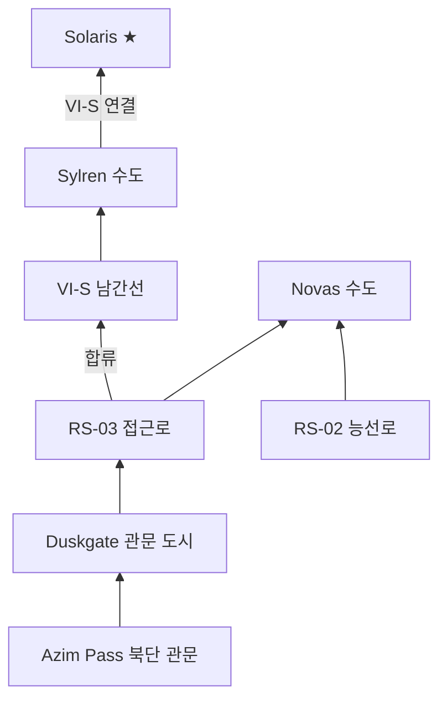

# 남부 지방 중로 — Soranth·Duskmoor·Lonwyn 권역

## 원전 인용 증명

### [필독 1] political_divisions.md:114–116
> "Soranth / 소란스 / 남중앙 평원 / 실렌 왕국 ... Duskmoor / 더스크무어 / 남동 국경 구릉 / 노바스 왕국 ... Lonwyn / 론윈 / 남서 호수 / 알드릭 왕국"
— political_divisions.md:114–116

### [필독 2] geography/rivers_major_2026-04-22.md:94–98
> "Soranth River ... 방향을 틀어 Sylren·Novas 왕국을 거쳐 남쪽 Soranth Estuary 로 흘러간다."
— rivers_major_2026-04-22.md:94–98

### [필독 3] geography/rivers_major_2026-04-22.md:98
> "Duskway River ... Novas 왕국 남부를 관통해 남동 해안으로 합류 ... Azim Pass 방향의 마지막 수계 역할."
— rivers_major_2026-04-22.md:98

### [필독 4] brainstorm_2026-04-21_worldview_expansion.md:176 (발언 5)
> "하단 주황식은 이어진길이다."
— 발언 5, brainstorm_2026-04-21_worldview_expansion.md:176 (남부 도로가 Azim Pass 로 연결됨)

### [필독 5] geography/elevation_profile_2026-04-22.md:85–87
> "Ⅲ 구릉대 / 200–800m / ... Duskmoor 구릉 / 활엽수림·방목지·산지 마을 / ... Novas"
— elevation_profile_2026-04-22.md:85–87

### [필독 6] FAILURES.md:57
> "대표님 원안에 없는 서술은 (추정) 표기 의무"
— FAILURES.md:57

### [필독 7] _shared_briefing.md:80–82
> "추가·병합·삭제 금지. 신규 확장은 왕국 내부 공작령·백작령·남작령·도시·마을만 가능"
— _shared_briefing.md:80–82

---

## 요약

남부 지방 중로는 Sylren·Novas·Aldric·Ceren 4개 왕국의 C급 지방도 네트워크다. 핵심 기능은 세 가지다. ① Soranth 평원의 농산물을 남쪽으로 모아 Azim Pass 방향으로 수출 ② Duskmoor 구릉의 광물·목재를 해안으로 연결 ③ Lonwyn 호수군 어업 물자를 내륙으로 분산. 남부 도로망의 남쪽 끝은 Azim Pass 북단 관문 도시에서 `highway_azim_pass_2026-04-22.md` 와 합류한다.

---

## 1. 남부 지방 중로 목록

| # | 노선명 | 권역 | 연장 (추정) | 핵심 기능 |
|---|--------|------|-----------|---------|
| RS-01 | **Soranth Estuary Road** | Sylren·Novas 남단 | ~150 km | Soranth 강 하구 남북 연결 |
| RS-02 | **Duskmoor Spine Road** | Novas 내부 | ~180 km | 구릉 능선 종단·광물 수송 |
| RS-03 | **Duskgate Approach Road** | Novas 최남단 | ~100 km | Azim Pass 북문 접근로 |
| RS-04 | **Lonwyn Circuit Road** | Aldric | ~160 km | 호수군 주변 순환 |
| RS-05 | **Ceren Wetland Causeway** | Ceren | ~90 km | 습지 제방도 |
| RS-06 | **Aldric–Novas Link** | Aldric·Novas 경계 | ~120 km | 남부 동서 연결 |
| RS-07 | **Sylren–Ceren Southern Road** | Sylren·Ceren | ~140 km | 남중앙 ↔ 서남 연결 |

---

## 2. 핵심 노선 상세

### 2-1. RS-03 Duskgate Approach Road (아짐 북문 접근로)

**경로**: Novas 남부 내부 도시 → 지협 진입 관문 도시 (가칭 Duskgate)
**연장**: ~100 km
**기능**: Via Imperialis VI-S 남간선의 최남단 연장이자, Azim Pass 로 진입하는 **최후 집결 도로**. 상인·외교관·군대 모두 이 도로를 통해 관문 도시에서 통행 허가를 받은 뒤 지협으로 진입한다.
- **폭**: 5~6m (넓음 — 통행량 많음)
- **자재**: 자갈+흙다짐
- **관세소**: 관문 도시 직전 1개소

### 2-2. RS-02 Duskmoor Spine Road (더스크무어 능선로)

**경로**: Novas 수도 → Duskfell Range 능선 북단 → 능선 따라 남하 → RS-03 합류
**연장**: ~180 km
**기능**: Duskmoor 구릉(고도 200~600m)의 능선을 따라 Novas 왕국 내부를 남북으로 관통. 광물·목재·방목 이동.
- **위험**: Duskmoor 협곡 은신 타종족 (발언 50 반영·추정)

### 2-3. RS-04 Lonwyn Circuit Road (론윈 순환로)

**경로**: Aldric 수도 → Lonwyn Basin 호수군 북안 → 동안 → 남안 순환
**연장**: ~160 km
**기능**: Lonwyn Basin 5~7개 호수(추정)를 순환하며 어업·담수 물자를 Aldric 수도로 집결.
- **자재**: 흙+목판 (습지 접경 구간)
- **특이**: 호수 내 섬들은 소형 선박으로만 접근 가능

### 2-4. RS-05 Ceren Wetland Causeway (세렌 습지 제방도)

**경로**: Ceren 수도 → Loravel 습지 내부 거점들 → 하구 어항
**연장**: ~90 km
**기능**: Loravel 습지를 관통하는 제방 위 도로. 평지보다 1~2m 높게 쌓아 범람 시에도 통행 가능하도록 설계.
- **자재**: 돌·흙 제방 + 목판 구간
- **특이**: 연간 4~6주 봄 범람으로 일부 구간 통행 불가

---

## 3. Azim Pass 남부 연결 구조

---

## 4. 남부 도로 위험 구간

| 구간 | 위험 유형 | 위험도 |
|------|---------|------|
| Ceren 습지 제방도 일부 | 봄 홍수 침수 | 🔴 봄철 위험 |
| Duskmoor 협곡 구간 | 타종족 은신·산적 (추정) | 🟡 중간 |
| Azim Pass 접근 최남단 | 국경 긴장·검문 | 🟡 중간 |
| Lonwyn 호수 남안 | 계절 안개·길 불명 | 🟢 낮음 |

---

## 대표님 미확정 사항

- Novas 남부 관문 도시 이름 (본 문서 "Duskgate" 는 추정·가설)
- Lonwyn Basin 호수 개수·섬 수 — 미확정
- Ceren 습지 제방도의 건설 주체 (세렌 왕국 독자? 제국 지원?)

---

## 다음 Wave 의존 포인트

- **Wave 4 Kingdom-Detailer (Novas)**: RS-02·RS-03 상세, 관문 도시 구조
- **Wave 4 Kingdom-Detailer (Aldric)**: RS-04 Lonwyn Circuit 호수 도시
- **Wave 4 Kingdom-Detailer (Ceren)**: RS-05 습지 제방도 건설 역사
- **highway_azim_pass**: RS-03 이 Azim Pass 파일의 Elucia 측 접근로와 직접 연결

<!-- auto-generated-related:start -->
## 🔗 관련 (auto-generated)

> `scripts/obsidian/build_backlinks.py` 로 자동 생성. 수정 금지 — 다음 실행 시 덮어쓰여집니다.

### ⬆️ 상위

- [[../../../../MOC]] — wiki 루트
- [[../MOC]] — Elucia 허브

### 📑 카테고리 개요

- [[00_overview]]

### 🔗 형제 노드

- [[bridges_and_fords_2026-04-22]]
- [[highway_azim_pass_2026-04-22]]
- [[highway_kings_road_2026-04-22]]

<!-- auto-generated-related:end -->
