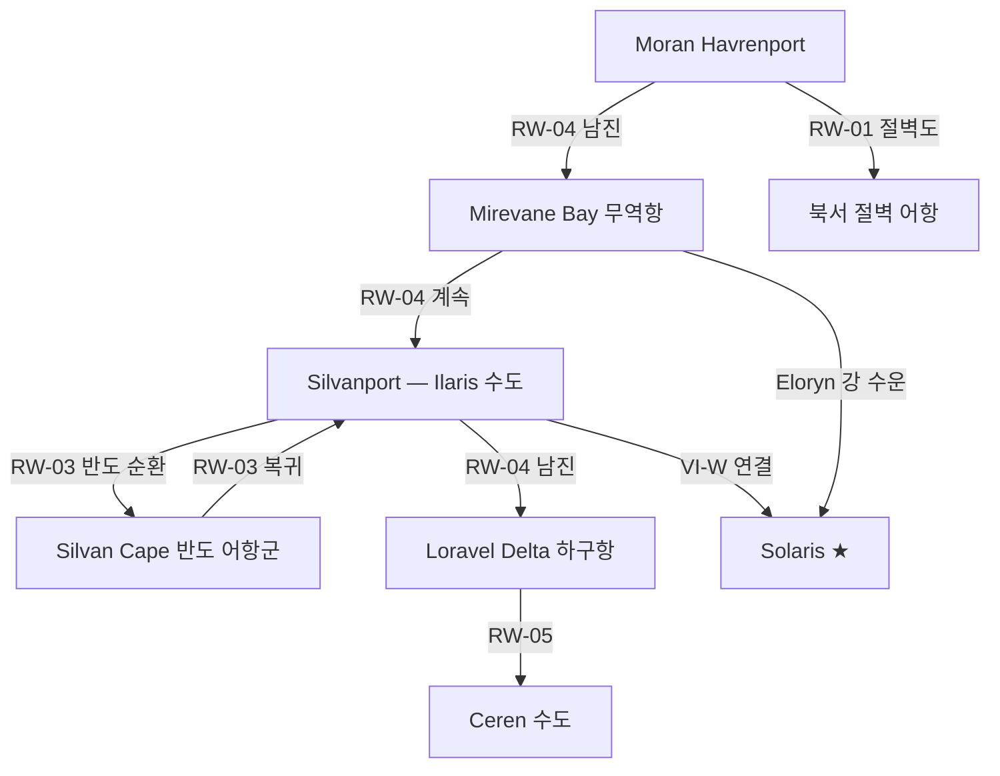

# 서해안 연안 도로 — Silvan·Loravel·Havren 권역

## 원전 인용 증명

### [필독 1] geography/coastlines_2026-04-22.md:53–57
> "서해안 / 대륙 서쪽 / ~1,800 km / 리아스식·복잡 / 서방 대해 (이름 미확정)"
— coastlines_2026-04-22.md:53–57

### [필독 2] political_divisions.md:55–56
> "일라리스 / Ilaris / 서해안 / 세렌 / Ceren / 서남 습지"
— political_divisions.md:55–56

### [필독 3] geography/coastlines_2026-04-22.md:71–75
> "Silvan Cape / 반도 / Silvan 권역 중부 / Ilaris 왕국 주요 항구 반도 ... Mirevane Bay / 만 / Silvan 권역 북부 / 수심 깊음"
— coastlines_2026-04-22.md:71–75

### [필독 4] brainstorm_2026-04-21_worldview_expansion.md:176 (발언 5)
> "빨간색 점이 항구(북쪽얼음섬으로가는 유일한길 ... 섬하단의 항구에서 좌우대륙의 교류 및 상업이 발달"
— 발언 5, brainstorm_2026-04-21_worldview_expansion.md:200–203

### [필독 5] geography/rivers_major_2026-04-22.md:53
> "Eloryn River ... 하구 / 서해안 Mirevane Bay"
— rivers_major_2026-04-22.md:53

### [필독 6] FAILURES.md:57
> "대표님 원안에 없는 서술은 (추정) 표기 의무"
— FAILURES.md:57

### [필독 7] geography/coastlines_2026-04-22.md:143–150
> "왕국 / 해안 접면 / 해양 의존도 / Ilaris / 서해안 (Silvan 권역) / 높음 ... Moran / 북서 해안 / 중간"
— coastlines_2026-04-22.md:143–150

---

## 요약

서해안 연안 도로는 Elucia 서쪽 리아스식 해안선(~1,800 km)을 따라 남북으로 연결하는 C급 지방 연안 도로망이다. 어항·무역항을 거점으로 해안 도로가 끊기지 않고 이어지며, 내륙 Via Imperialis 와 항구를 연결하는 **해육(海陸) 결합 통로** 역할을 한다. 리아스식 지형 특성상 만·곶이 많아 도로가 직선이 아닌 구불구불한 형태를 띤다.

---

## 1. 서해안 연안 도로 목록

| # | 노선명 | 구간 | 연장 (추정) | 핵심 기능 |
|---|--------|------|-----------|---------|
| RW-01 | **Moran Cliff Road** | Moran 북서 해안 전체 | ~120 km | 절벽 어항 연결 |
| RW-02 | **Mirevane Bay Road** | Mirevane Bay 주변 | ~80 km | 주력 무역항 집결 |
| RW-03 | **Silvan Cape Circuit** | Silvan Cape 반도 | ~100 km | Ilaris 핵심 항구 연결 |
| RW-04 | **Silvan Coast Main Road** | Ilaris 수도 ↔ 북단 | ~200 km | Silvan 권역 남북 연안로 |
| RW-05 | **Loravel Delta Access Road** | Ceren 서남 해안 | ~90 km | 삼각주 어항·소금 집하 |
| RW-06 | **Westfall Inlet Road** | Silvan·Loravel 경계 | ~60 km | 내만 연결 도로 |
| RW-07 | **Aldric Spit Road** | Aldric 남서 모래톱 | ~70 km | 내만 어업 기지 연결 |

---

## 2. 핵심 노선 상세

### 2-1. RW-04 Silvan Coast Main Road (실반 해안 주도로)

**경로**: Moran 남단 접경 → Mirevane Bay → Ilaris 수도 Silvanport → Silvan Cape → Loravel Delta 북단
**연장**: ~200 km
**기능**: 서해안 전체를 남북으로 꿰는 **서해안 대동맥 연안도**. Ilaris 왕국이 건설·유지.
- **폭**: 4~5m
- **자재**: 자갈 (해안 모래·암반 혼합)
- **특이**: Via Imperialis VI-W 와 Silvanport 에서 합류. Silvanport = 해육 분기점.

### 2-2. RW-03 Silvan Cape Circuit (실반 곶 순환로)

**경로**: Silvanport → Silvan Cape 반도 일주 → Silvanport 복귀
**연장**: ~100 km
**기능**: Silvan Cape 반도의 어항·소규모 무역항 전체를 순환하며 물자를 Silvanport 로 집결.
- **수산물·수입품 반입**: 반도 내 20~30개 어항(추정)에서 매일 집하

### 2-3. RW-01 Moran Cliff Road (모란 절벽도)

**경로**: Moran 수도 Havrenport → 북서 해안 절벽 구간 → 최북단 어항
**연장**: ~120 km
**기능**: Mornhaven 절벽(높이 50~120m) 위를 따라가는 위험한 연안도. 어항 연결이 유일한 목적.
- **위험**: 절벽 낙석·해풍·안개 — 폭 2~3m 의 좁은 벼랑길
- **통행 제한**: 대형 마차 불가, 우마차·도보만 가능

---

## 3. 서해안 도로-항구 연계 구조

---

## 4. 해안 도로 계절별 통행 조건

| 구간 | 봄 | 여름 | 가을 | 겨울 |
|------|-----|------|------|------|
| Moran 절벽도 | 폭풍 위험 | 양호 | 폭풍 위험 | 해빙·결빙 |
| Silvan Coast | 양호 | 최고 | 양호 | 가능 |
| Loravel Delta | 홍수 위험 | 양호 | 양호 | 가능 |
| Westfall Inlet | 조수 주의 | 양호 | 양호 | 안개 |

---

## 대표님 미확정 사항

- Silvanport (Ilaris 수도 항구)의 도시 이름·규모 — Wave 4 담당
- 서방 대해의 공식 이름 — Toponymist 담당
- Moran 북서 절벽 최북단 어항의 이름·규모

---

## 다음 Wave 의존 포인트

- **Wave 4 Kingdom-Detailer (Ilaris)**: RW-03·RW-04 의 항구 도시 상세
- **Wave 4 Kingdom-Detailer (Moran)**: RW-01 절벽도 어항 군락
- **sea_lanes_coastal**: 이 연안 도로와 병행하는 해로와의 관계
