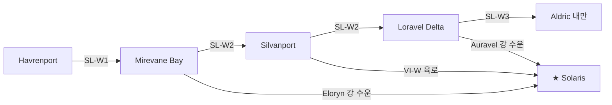

# 연안 해로 — 서해안·남해안

## 원전 인용 증명

### [필독 1] brainstorm_2026-04-21_worldview_expansion.md:176 (발언 5) ★ 핵심
> "대륙윗쪽에서는 좌우 모두 물길이 너무험하고 작은 암초가 많아서 불가능, 몬스터도 많음."
— 발언 5, brainstorm_2026-04-21_worldview_expansion.md:176 (**북쪽 해로 완전 불가 확인**)

### [필독 2] geography/coastlines_2026-04-22.md:53–57
> "서해안 / ~1,800 km / 리아스식·복잡 / 서방 대해 (이름 미확정) ... 북 해안 / ~500 km / 암초·위험 / Veil Sea (접근 불가)"
— coastlines_2026-04-22.md:53–57

### [필독 3] geography/coastlines_2026-04-22.md:95–103
> "통항 가능 여부 / 불가 — 암초·몬스터·험한 물길 3중 장벽 / 상업적 기능 / 없음"
— coastlines_2026-04-22.md:95–103

### [필독 4] brainstorm_2026-04-21_worldview_expansion.md:200–205 (발언 5 항구)
> "빨간색 점이 항구 ... 섬하단의 항구에서 좌우대륙의 교류 및 상업이 발달"
— 발언 5, brainstorm_2026-04-21_worldview_expansion.md:200–205

### [필독 5] political_divisions.md:55–62
> "일라리스 / Ilaris / 서해안 ... 세렌 / Ceren / 서남 습지 ... 모란 / Moran / 북서 ... 알드릭 / Aldric / 남서 호수"
— political_divisions.md:55–62

### [필독 6] FAILURES.md:57
> "대표님 원안에 없는 서술은 (추정) 표기 의무"
— FAILURES.md:57

### [필독 7] geography/coastlines_2026-04-22.md:129
> "Azim Narrows / 지협 해협 / 남부 통행로 양쪽 / 두 대륙 사이 좁은 수로"
— coastlines_2026-04-22.md:129

---

## 요약

Elucia 연안 해로는 **서해안 해로** 와 **남해안 해로** 두 축으로 구성된다. **북쪽 해로는 발언 5 원문 준수 — Veil Sea 암초·몬스터로 완전 불가능**. 서해안 해로는 Moran 북서 → Silvanport → Loravel Delta 를 잇는 남북 연안 항로로, 육로보다 빠르고 대용량 수송이 가능하다. 남해안 해로는 Soranth Estuary 에서 Azim Narrows 까지 이어지며, 지협 근방 수로는 조류가 강해 소형 선박만 가능하다.

---

## ⚠️ 항로 가능/불가 요약 (발언 5 원문 기반)

| 해역 | 항로 가능 여부 | 근거 |
|------|------------|------|
| **Veil Sea (북해)** | **완전 불가** | 발언 5: "물길이 너무험하고 작은 암초가 많아서 불가능, 몬스터도 많음" |
| 서해안 연안 | **가능** | 리아스식 피항지 풍부 |
| 남해안 연안 | **가능 (조건부)** | Azim Narrows 근방 조류 강함 |
| Nomen 섬 → Veilglass | **별도 파일** | sea_lanes_to_veilglass 참조 |

---

## 1. 서해안 해로 (SL-W 계열)

### 1-1. SL-W1 Northern Arc Sea Lane (북서 연안 항로)

**경로**: Moran 수도 항구 Havrenport → Mirevane Bay → Silvanport
**연장**: ~400 km (해상 거리)
**특성**: Mornhaven 절벽을 따라가는 절벽 해안 항로. 피항지가 적고 돌풍 위험 높음.

| 항목 | 내용 |
|------|------|
| 통행 선박 | 중형 상선·어선 |
| 주요 위험 | Mornhaven 절벽 해역 돌풍·안개 |
| 통행 기간 | 봄·가을 위험 / 여름 양호 / 겨울 부분 가능 |
| 주요 물자 | Moran 어획물 → Silvanport 남하 / Ilaris 직물 → Moran 북상 |

---

### 1-2. SL-W2 Silvan Main Sea Lane (실반 주항로) — 서해안 핵심

**경로**: Silvanport → Silvan Cape 외해 우회 → Westfall Inlet → Loravel Delta
**연장**: ~300 km
**특성**: 서해안 최대 교역 항로. Silvan Cape 반도를 외해로 우회하거나 내해 만을 활용.

| 항목 | 내용 |
|------|------|
| 통행 선박 | 대형 상선·소형 함대 |
| 항구 기항지 | Silvanport → 3~4개 중간 어항 → Loravel Delta |
| 주요 물자 | Ilaris 무역품 (수입물) → Eloryn 강 수운 → Solaris |
| 수운 연계 | Loravel Delta에서 Auravel 강 수운 접속 → 내륙 수송 |

---

### 1-3. SL-W3 Loravel–Aldric Coastal Lane

**경로**: Loravel Delta → Westfall Inlet → Aldric Spit → Aldric 내만
**연장**: ~200 km
**특성**: 서남 해안 내만 항로. 잔잔한 내만 덕분에 소형 선박도 가능. 어업·소금 교역 위주.

---

## 2. 남해안 해로 (SL-S 계열)

### 2-1. SL-S1 Soranth Coastal Lane

**경로**: Soranth Estuary → 남해안 동진 → Dusk Cape
**연장**: ~250 km
**특성**: Novas 남동 해안을 따르는 연안 항로. 조석 영향 大.

### 2-2. SL-S2 Azim Approach Sea Lane (아짐 관문 접근 해로)

**경로**: Dusk Cape → Novas Shallows → Azim Narrows 서쪽 어귀
**연장**: ~200 km
**특성**: Azim 지협 양쪽 해협(Narrows)은 조류가 강하고 사구 여울이 많아 **소형 선박만 통행 가능**. 대형 상선은 불가. 밀수에 활용되기도 함 (추정).

---

## 3. 주요 항구 및 기항지

| 항구 | 소속 왕국 | 규모 | 주요 기능 |
|------|---------|------|---------|
| **Havrenport** | Moran | 중형 | 어항·군항·북서 기점 |
| **Mirevane Bay 항구** | Ilaris·Vaelin 접경 | 대형 (추정) | 제국 외항·무역 집결 |
| **Silvanport** | Ilaris | 대형 | 제국 최대 서해안 무역항 (추정) |
| **Loravel Delta 항구** | Ceren | 중형 | 하구항·소금·어업 |
| **Aldric 내만 항구** | Aldric | 소형 | 내만 어업·담수 |
| **Soranth Estuary 항구** | Novas·Sylren 접경 | 중형 | 하구 교역 |
| **Dusk Cape 항구** | Novas | 소형 | 연안 어업 |

---

## 4. 수운(河運)·해로 연계 구조

---

## 대표님 미확정 사항

- 서방 대해의 공식 이름 — Toponymist 담당
- Silvanport 규모·항구 시설 상세 — Wave 4 담당
- Azim Narrows 해협 통행 가능 최대 선박 규모
- 해로 관할 (항구 조합? 왕국 해군?)

---

## 다음 Wave 의존 포인트

- **Wave 4 Kingdom-Detailer (Ilaris)**: Silvanport 항구 도시 상세
- **Wave 3 Economist**: 서해안 해로 교역량·주요 수출입 품목
- `sea_lanes_to_veilglass`: 이 파일과 별개인 Nomen·Veilglass 항로 상세
- `regional_roads_western_coast`: 연안 도로와 연안 해로의 병행 관계
