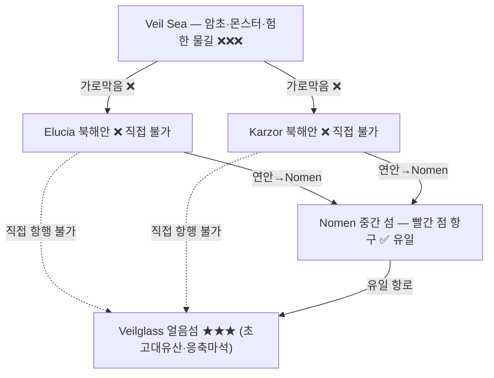

# Veilglass 항로 — Nomen 남단 항구에서 북쪽 얼음섬으로 가는 유일한 길

## 원전 인용 증명

### [필독 1] brainstorm_2026-04-21_worldview_expansion.md:176 (발언 5) ★★ 최최우선 원전
> "북쪽은 얼음섬, 중간에 작은섬이있고 빨간색 점이 항구(북쪽얼음섬으로가는 유일한길, 나머지는 갈수가없다. 대륙윗쪽에서는 좌우 모두 물길이 너무험하고 작은 암초가 많아서 불가능, 몬스터도 많음."
— 발언 5, brainstorm_2026-04-21_worldview_expansion.md:176

### [필독 2] brainstorm_2026-04-21_worldview_expansion.md:199–206 (발언 5 구조화)
> "빨간 점 = 항구 (북쪽 얼음섬으로 가는 유일한 접근로) / 현재 여러 종족이 어느 정도 공생 중 / 섬 하단 항구 = 좌우 대륙 교류·상업 발달 / 반 무법지대 / 좌우 대륙이 이 섬을 놓고 자주 싸움"
— brainstorm_2026-04-21_worldview_expansion.md:199–206

### [필독 3] political_divisions.md:28–29
> "베일글라스 / Veilglass / 무인 · 초고대 유산 · 수정 2 봉인지 ... 노멘 / Nomen / 항구 · 여러 종족 공생 · 해적 무법지 · 북쪽 유일 접근"
— political_divisions.md:28–29

### [필독 4] brainstorm_2026-04-21_worldview_expansion.md:237 (발언 6)
> "북쪽에는 초고대문명의 유산과 응축된 마석이 매우 많이 매장되어있어 동서대륙간 중앙 작은섬을 차지하려 전쟁중"
— 발언 6, brainstorm_2026-04-21_worldview_expansion.md:237

### [필독 5] geography/coastlines_2026-04-22.md:93–107
> "통항 가능 여부 / 불가 — 암초·몬스터·험한 물길 3중 장벽 / Veil Sea 의 암초군 중 '가장 깊은 곳에 무언가가 잠들어 있다' 는 항해사 전설"
— coastlines_2026-04-22.md:95–108

### [필독 6] FAILURES.md:57
> "대표님 원안에 없는 서술은 (추정) 표기 의무"
— FAILURES.md:57

### [필독 7] _shared_briefing.md:63–65
> "수정 1·2, 마왕, 첫 번째 신, 황금기, 할배 등은 기록된 역사·전설 층위에서 모호하게 등장 / 구조적 진실 ... 직접 서술 금지"
— _shared_briefing.md:63–65

---

## 요약

**발언 5 원문 엄수**: 북쪽 얼음섬 Veilglass 로 가는 유일한 항로는 **중간 섬 Nomen 남단 항구** 에서 출발한다. Elucia 또는 Karzor 북해안에서 직접 항행하는 것은 Veil Sea 암초·몬스터·험한 물길로 **완전 불가능**이다. Nomen 섬 자체가 이 유일 접근권 때문에 양 대륙의 쟁탈 대상이 된다. Veilglass 는 초고대문명 유산과 응축 마석 매장지로, 이 항로는 세계관 최고 전략 항로다.

---

## 1. 항로 전제 — 왜 Nomen 만 가능한가

---

## 2. Nomen 남단 항구 (빨간 점)

**발언 5 확정 사항** (원문 그대로 반영):
- 빨간색 점 = **항구** (북쪽 얼음섬으로 가는 **유일한** 길)
- 섬 하단의 항구 = 좌우 대륙 교류·상업 발달 거점
- **반 무법지대** — 자주 싸움 발생, 안전지대 아님
- 해적 판침

| 항목 | 내용 |
|------|------|
| 위치 | Nomen 섬 남단 |
| 규모 | (추정) 대형 항구 — 양 대륙 교역 집결 |
| 특성 | 다종족 공생 · 반 무법지대 · 해적 |
| 통행세 | (추정) 항구 조합 또는 지배 세력이 징수, 기준 불명확 |
| 접근 방법 | 양 대륙 연안 항로 → Nomen 남항 입항 |

### 2-1. Nomen 접근 항로 (양 대륙에서)

| 항로 | 출발점 | 경유 | 거리 (추정) | 소요 일수 (추정) |
|------|--------|------|-----------|-------------|
| **EL-NOM** | Elucia 서해안 최북단 항구 | 해안 북상 | ~300 km | 3~5일 |
| **KZ-NOM** | Karzor 북동 항구 (Qorath) | 해안 북상 | ~250 km | 2~4일 |

**주의**: Elucia 북해안 직접 접근은 불가. 서해안에서 우회하여 북상 후 Nomen 방향 도달.

---

## 3. Nomen → Veilglass 항로 (SL-VG)

**세계관 유일 북행 항로**. 일반 항해사는 거의 도전하지 않는 위험 항로.

| 항목 | 내용 |
|------|------|
| 출발 | Nomen 남단 항구 |
| 종착 | Veilglass 섬 남쪽 해안 (추정·미확정) |
| 거리 | (추정) ~200~400 km (Veilglass 위치 미확정) |
| 소요 시간 | (추정) 5~10일 (Veil Sea 기상 의존) |
| 항행 가능 선박 | 강화 선체·경험 많은 선원 필수 |
| 주요 위험 | Veil Sea 암초·수중 몬스터·빙산(북쪽 접근 시) |
| 시도 빈도 | 극히 드뭄 — 탐험대·군사 원정 수준만 |

### 3-1. 항로 위험 등급

| 구간 | 위험 유형 | 위험도 |
|------|---------|------|
| Nomen 출항 직후 | 해적·세력 분쟁 | 🟡 중간 |
| Veil Sea 남부 | 암초군 시작 | 🔴 높음 |
| Veil Sea 중부 | 암초·몬스터 집중 | ⛔ 극도 위험 |
| Veilglass 접근 | 빙산·안개 | 🔴 높음 |

---

## 4. Nomen 섬의 전략 가치

**발언 6 연결**: Veilglass 에 초고대문명 유산·응축 마석 매장 → Nomen 항구 = 그 유일한 관문

| 쟁탈 주체 | 목적 | 현재 상황 |
|---------|------|---------|
| Elucia 성좌국 | 마석 독점·종교적 성지 통제 | 쟁탈 중 (추정) |
| Karzor 왕조 | 마석 경제 독점·군사 우위 | 쟁탈 중 (추정) |
| 다종족 세력 | 중립 지대 유지·교역 이익 | 공생 중 (발언 5) |
| 해적 세력 | 통행세 착복·약탈 | 활동 중 (발언 5) |

---

## 5. 전설 층위 (Q-CORE 간접 단서)

*구조적 진실 직접 서술 금지.*

- Nomen 항구 가장 오래된 선술집 벽에는 **"첫 번째 항해자는 돌아오지 않았다"** 는 낡은 명판이 있다고 전해진다. 그 명판 아래에 이름이 적혀 있다가 지워진 흔적이 있다. (대표님 미확정 — 모호 보존)
- Veil Sea 의 특정 암초 주변에서는 **나침반이 오작동**한다는 항해사 증언이 Nomen 에 쌓여 있다. 일부 마법사는 이를 *"막대한 마력의 잔류"* 라 하나 공식 교회 기록은 없다. (Q-CORE 간접 단서 — 해석 금지)

---

## 대표님 미확정 사항

- Nomen 섬 크기·내부 지형 — 현재 완전 미확정
- Veilglass 섬 내부 — **대표님 미확정 (모호 보존 의무)** — 빈 공간 유지
- Nomen 항구의 실질 지배 세력 — 공생 중이나 주도권 불명
- Elucia → Nomen 접근 최북단 항구의 위치·이름

---

## 다음 Wave 의존 포인트

- **Wave 3 Historian**: Nomen 섬 전쟁 역사·현재 분쟁 경위
- **Wave 3 Diplomat**: Nomen 을 둘러싼 양 대륙 조약·휴전 상태
- **Wave 4 Kingdom-Detailer (Thaloss/Vaelin)**: Elucia 북부에서 Nomen 행 항구 도시
- **(Veilglass 내용)**: 대표님 미확정 보존 — 이 파일에서 추정 불가
