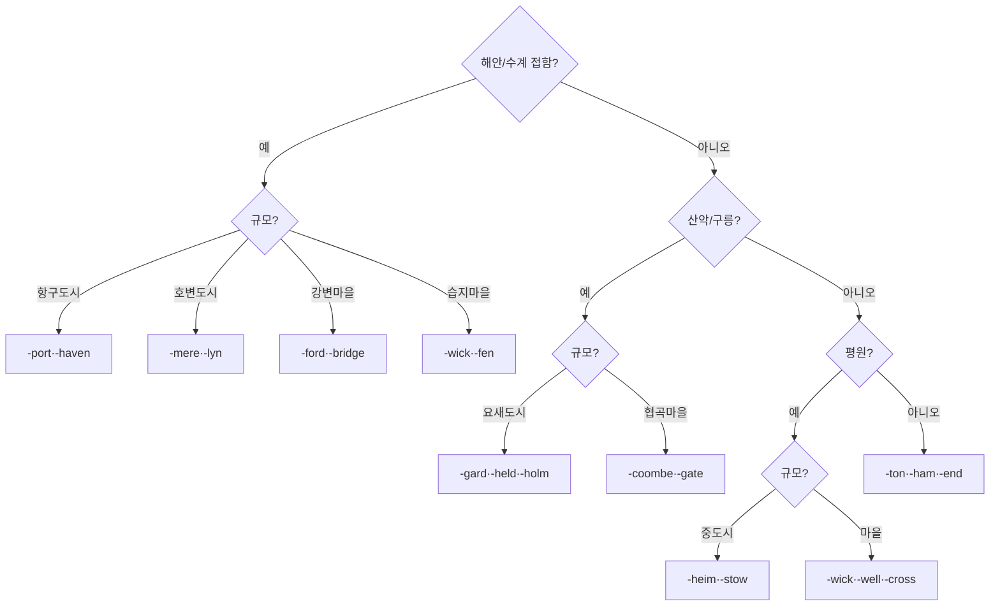

# Elucia 지명 접미사 체계 (Suffix Patterns)

## 원전 인용 증명

### [필독 1] political_divisions.md:140-146 (네이밍 원칙)
> "FF7·Nier Automata·Disco Elysium 조어 톤 / WoW 풍 회피 / 고대·신비로움 / 발음 가능"
— political_divisions.md:140-146

### [필독 2] political_divisions.md:105-116 (확정 권역 지명 접미사 분석)
> "Norvend / Auryn / Havren / Silvan / Loravel / Aurion / Orenwald / Soranth / Duskmoor / Lonwyn"
— political_divisions.md:105-116

### [필독 3] brainstorm_2026-04-21_worldview_expansion.md:302-313 (발언 8)
> "타종족은 주변 작은 섬들이나 대륙의 가장자리의 밀림이나 숲, 사막한가운데서 숨어서 생활한다."
— 발언 8, brainstorm_2026-04-21_worldview_expansion.md:304

### [필독 4] game_setting_complete_2026-04-21.md:180-188 (종족 생태학)
> "인간 / 많음 / 자연적 높은 번식력 / 신(교회) / 15-18세(추정) / 최약체·흩어져 살음 → 초기 교회가 결집 제공"
— game_setting_complete_2026-04-21.md:180-188

### [필독 5] .claude/failures/FAILURES.md:91-94 (FAIL-003)
> "Bash 도구 안에서 `cd` 금지. 모든 경로는 절대경로로. 여러 디렉토리 순회 시 절대경로 형식"
— FAILURES.md:91-94

---

## 요약

Elucia 지명 접미사는 **정착 유형별·규모별·지형별** 로 체계화된다. 핵심 접미사 40개를 정착지·지형·왕국 특수·고대 4개 그룹으로 분류한다. Wave 4 Kingdom-Detailer 가 마을명 생성 시 이 접미사 체계를 의무 준수한다.

---

## 1. 정착지 접미사 (Settlement Suffixes) — 18개

| 접미사 | 의미 | 규모 | 주 사용 왕국 | 예 |
|--------|------|------|------------|---|
| **-heim** | 고향·본거지 | 중소도시 | 북부 (Vaelin·Thaloss) | Vaeltheim, Norheim |
| **-holm** | 강섬·방어 도시 | 소도시·요새 | 하천 왕국 전반 | Saltholm, Riverholm |
| **-gard** | 성채·방어 취락 | 요새·변경 도시 | 북동부·국경 | Vaelgard, Norngard |
| **-held** | 영웅의 땅·거점 | 중도시 | 중부·성좌국 | Mornheld, Stoneheld |
| **-port** | 항구·교역 도시 | 항구 도시 | 해안 왕국 | Westport, Ironport |
| **-wick** | 농업 취락·작은 마을 | 마을 | 전역 | Fenwick, Grenwick, Ashwick |
| **-ton** | 정착지·마을 | 마을 | 평원 왕국 | Ashton, Millton |
| **-ford** | 여울 마을 | 마을 | 강변 왕국 | Ashford, Dunford |
| **-mere** | 호변 도시·내항 | 소도시 | Aldric·Ceren | Longmere, Silvenmere |
| **-well** | 샘·우물 마을 | 마을 | 평원·내륙 | Coldwell, Dawnwell |
| **-ham** | 주거지·집단 거주 | 마을 | 성좌국 영향권 | Silverham, Elmham |
| **-thorpe** | 단일 농장·소취락 | 취락 | 변경·변방 | Dunthorpe, Greythorpe |
| **-stow** | 집합지·시장 | 소도시 | 교역로 | Fairstow, Oldstow |
| **-holt** | 작은 숲 취락 | 마을 | 숲 인접 | Elmholt, Mornholt |
| **-coombe** | 협곡 마을 | 마을 | 산악 왕국 | Deepcoombe, Stoncoombe |
| **-end** | 변경 취락 | 마을 | 변경 지대 | Farmend, Westend |
| **-cross** | 교차로 도시 | 소~중도시 | 교통 요충 | Highcross, Millcross |
| **-bridge** | 교량 도시 | 소~중도시 | 강 교차점 | Mornbridge, Dawnbridge |

---

## 2. 지형 접미사 (Terrain Suffixes) — 12개

| 접미사 | 지형 유형 | 규모 | 예 |
|--------|---------|------|---|
| **-vale** | 계곡·골짜기 | 소규모 지형 | Elmvale, Longvale |
| **-moor** | 황야·황무지 | 광역 지형 | Duskmoor, Greymoor |
| **-wald·-wood** | 숲 | 광역 지형 | Orenwald, Duskveil Wood |
| **-fell** | 구릉·황야 고지 | 광역 지형 | Duskfell, Stonefell |
| **-ridge** | 능선 | 선형 지형 | Veilorn Ridge → Veilorn Ridge |
| **-cliff·-clift** | 절벽·벼랑 | 지형 feature | Morncliff, Dawncliff |
| **-fen** | 습지 | 광역 지형 | Loravel Fen, Fenwick |
| **-strand** | 해변 | 선형 해안 | Coldstrand, Saltstrand |
| **-brow** | 구릉 가장자리 | 완만 지형 | Silvan Brow |
| **-haven** | 내항·안전 만 | 항구 지형 | Mornhaven, Keldhaven |
| **-gate** | 고개·관문 | 통행로 | Greygate, Irongate |
| **-pass** | 산길·통과로 | 광역 통행로 | Azim Pass (확정) |

---

## 3. 왕국 특수 접미사 (Kingdom-Specific) — 10개

각 왕국이 내부 마을명에 선호하는 고유 접미사:

| 왕국 | 특수 접미사 | 의미 | 예 |
|------|-----------|------|---|
| **성좌국 Choir** | **-aris·-oris** | 라틴 형용사화·성소 | Solaris, Lumoris |
| **Vaelin** | **-thorn** | 가시나무·강인 | Vaelthorn, Coldthorn |
| **Moran** | **-haven·-cliff** | 항구·절벽 | Mornhaven, Greycliff |
| **Ilaris** | **-aven·-vane** | 켈트 강·잔물결 | Silveraven, Mirvane |
| **Ceren** | **-mere·-lyn** | 호수·물가 | Cernmere, Fenlyn |
| **Thaloss** | **-coombe·-hold** | 협곡·요새 | Deepcoombe, Ironhold |
| **Oryn** | **-wyn·-thil** | 켈트형 신비 | Orynthil, Darkwyn |
| **Maerith** | **-reth·-ath** | 고지 형용사화 | Maereth, Highrath |
| **Sylren** | **-field·-mill** | 평원·방앗간 | Sylfield, Goldmill |
| **Novas** | **-watch·-gate** | 감시·관문 | Northwatch, Stonegate |
| **Aldric** | **-mere·-lyn** | 호수 취락 | Aldrenmere, Mistlyn |

---

## 4. 고대·특수 접미사 (Q-CORE 단서용) — 6개

> 역사 지명·전설 지명에만 사용. 현재 생존 도시에는 사용 금지.

| 접미사 | 의미 (인-월드) | 실제 연관 | 사용 조건 |
|--------|-------------|---------|---------|
| **-aelith** | 고귀한 기억·잠든 곳 | 엘프·용족 시대 흔적 | 숲 깊은 곳·전설 유적 |
| **-khorath** | 어둠의 잔재 | 마족 황금기 흔적 | 폐허·금기 지명 |
| **-veleth** | 감춰진 자 | 수호자 개입 지점 | 고대 유적 (모호 보존) |
| **-grald** | 옛 질서의 자리 | 균형 수호자 파편 | 교회 이전 성지 |
| **-solis** | 첫 빛의 땅 | 첫 번째 신 시대 | 최고 성지급만 |
| **-durven** | 돌의 기억 | 드워프 고대 거주지 | 산맥 내 폐광 |

---

## 5. 접미사 선택 결정 트리

---

## 대표님 미확정 사항

- 마족·용족·엘프 정착지 접미사 — 대표님 미확정. 현재는 인간 문명권만 담당
- 고대 언어 접미사의 발음 방식 — 인-월드에서 현재 인간들이 어떻게 읽는지 미확정

## 다음 Wave 의존 포인트

- **Kingdom-Detailer (Wave 4)**: 각 왕국 마을 12~25개 생성 시 이 접미사 체계 의무 준수
- **Road-Engineer (Wave 2)**: 교차로(-cross)·교량(-bridge)·관문(-gate) 도시가 도로망 절점
- **Historian (Wave 3)**: 고대 접미사 지명이 실존하는 전설·폐허의 위치 마커
